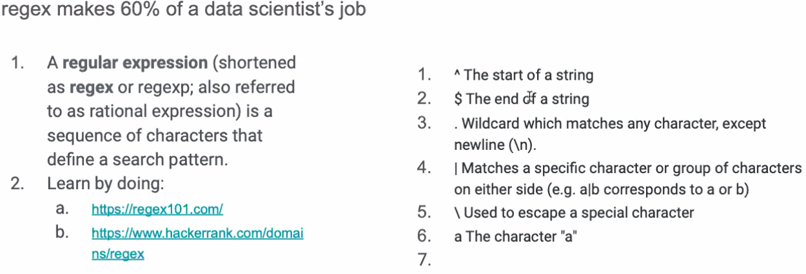
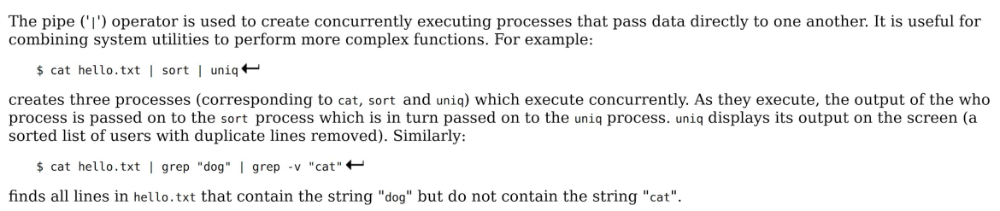
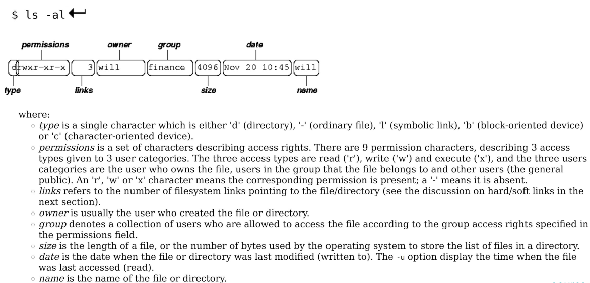
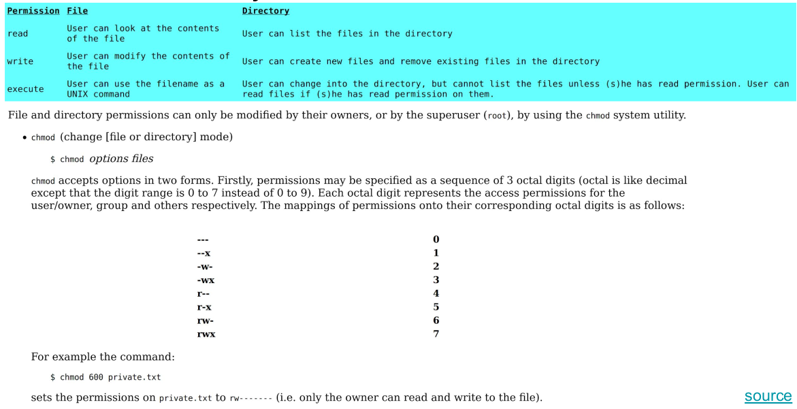
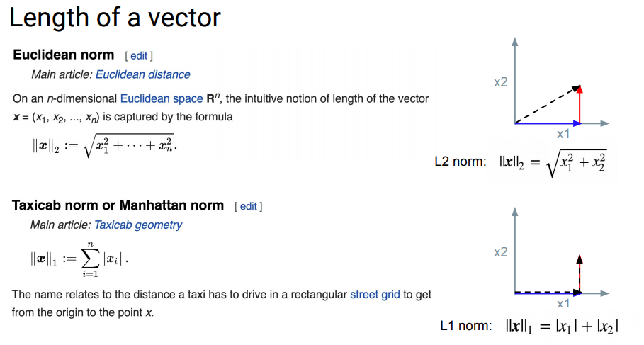
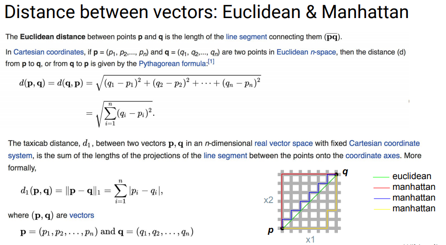
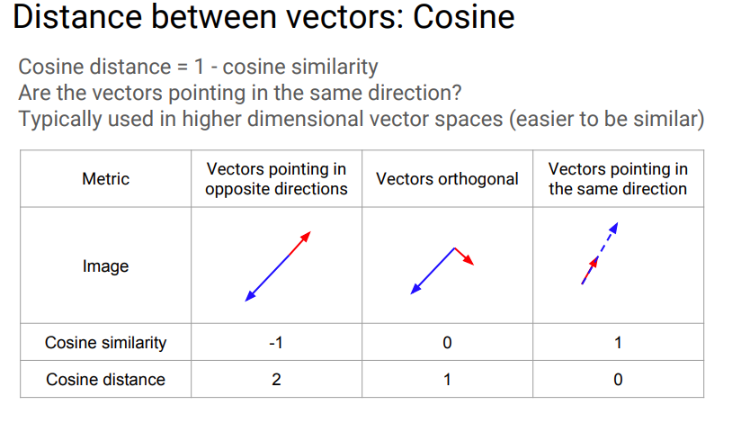
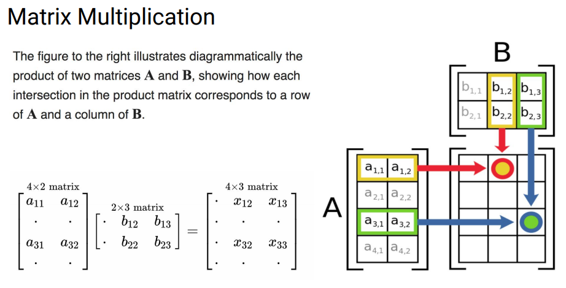

# Vim
`i` to insert  
<kbd>esc</kbd> to exit insert mode  
`:q` to quit  
`:wq` to write and quit (save and quit)  

[Vim Quick Reference](https://github.com/GalvanizeDataScience/course-outline/blob/20-10-DS-DEN_DEN19/quick-reference/Vim.pdf)

# VSCode
[VSCode Quick Reference - Linux](https://github.com/GalvanizeDataScience/course-outline/blob/20-10-DS-DEN_DEN19/quick-reference/VSCode_Linux.pdf)

# Regular Expressions (Regex)
[Build and Test Regex](https://regexr.com/)  
[Regex Guide with Examples](https://medium.com/factory-mind/regex-tutorial-a-simple-cheatsheet-by-examples-649dc1c3f285)



# Command Line

[DSI Lecture "Just enough command line"](https://github.com/GalvanizeDataScience/lectures/blob/Denver/unix/chris-reger/Unix.pdf)  
[Unix/Command Line Tutorial](http://www.ee.surrey.ac.uk/Teaching/Unix/)  
[Command Line Quick Reference](https://github.com/GalvanizeDataScience/course-outline/blob/20-10-DS-DEN_DEN19/quick-reference/LinuxUnix.pdf)  
Codecademy Quick Explanations: [1](https://www.codecademy.com/articles/command-line-commands), [2](https://www.codecademy.com/learn/learn-the-command-line/modules/learn-the-command-line-navigation/cheatsheet)

## Helper Commands that make everything easier.
* `clear` - Clears the terminal.
* `exit` - Exits the terminal.
* `man` *`command_name`* - Opens the manual for the command.
* <kbd>Tab</kbd> to autocomplete the line.
* Up or down arrows to scroll through previous commands.
* To jump to beginning of line: <kbd>CTRL + a</kbd>
* To jump to end of line: <kbd>CTRL + e</kbd>
* <kbd>Ctrl + C</kbd> to kill a job

## Common Commands

|Command|Meaning|
|----------|:-------------|  
|**ls**|lists the contents of your current working directory|  
|**ls -a**|lists all files and directories including hidden ones|
|**ls -l**|long descriptions|
|**ls -S**|sort by size|
|**ls -T**|sort by time last modified|
|**mkdir** *name_of_directory*|make a new directory|
|**touch** *name_of_file*|make a new file|
|**pwd**|shows the current working directory|
|**cd** *name_of_directory*|change directory|  
|**cd .**|change to current directory|
|**cd ..**|change to parent directory (one level up the tree/file structure)|
|**cd** or **cd ~**|change to home directory|
|**mv** *file_name* &nbsp;*new_file_location*|move a file to a new directory|
|**mv** *file_name* &nbsp;*new_file_name*|rename a file|
|**cp** *original_file_name* &nbsp;*new_file_name*|make a copy of a file|
|**rm** *file_name*|removes(deletes) the file|
|**rm -f** *file_name*|force deletion of the file if it is protected|
|**rm -r** *file_name*|recursive delete. removes all subfolders and files within the directory|
|**find . -name** *text_to_match*|find files in cd that match the text given| 
|**Exploring Files**||
|**cat** *file_name*|displays the contents of the file|
|**less** *file_name*|displays the contents of the file one page at a time|
|**head** *file_name*|displays the first ten lines of the file|
|**tail** *file_name*|displays the last ten lines of the file|
|**wc -w** *file_name*|word count of file|
|**wc -l** *file_name*|line count of file|
|**sort** *file_name*|sorts each line of file alphabetically|
|**uniq** *file_name*|removes duplicate lines|

` `  
` `  
## Simple searching using less

[How to use the **less** command](https://linuxize.com/post/less-command-in-linux/)  

Using less, you can search though a text file for a keyword (pattern). For example, to search through science.txt for the word 'science', type

    $ less science.txt

then, still in less, type a forward slash [/] followed by the word to search

    /science

As you can see, less finds and highlights the keyword. Type [n] to search for the next occurrence of the word.

` `  
` `  
## Searching using grep “global regular expression print”

grep is one of many standard UNIX utilities. It searches files for specified words or patterns. First clear the screen, then type

    $ grep science science.txt

As you can see, grep has printed out each line containg the word science.

Or has it ????

Try typing

    $ grep Science science.txt

The grep command is case sensitive; it distinguishes between Science and science.

To ignore upper/lower case distinctions, use the -i option, i.e. type

    $ grep -i science science.txt

To search for a phrase or pattern, you must enclose it in single quotes (the apostrophe symbol). For example to search for spinning top, type

    $ grep -i 'spinning top' science.txt

Some of the other options of grep are:  
**-v** display those lines that do NOT match  
**-n** precede each matching line with the line number  
**-c** print only the total count of matched lines
**-R** recursive. search all files in a directory
**-c** count of occurances


## Pipes


## Redirection
## **>**  

    $ cat oceans.txt > continents.txt
**>** takes the standard output of the command on the left and redirects it to the file on the right.

## **>>**
    $ cat glaciers.txt >> rivers.txt
**>>** takes the standard output of the command on the left and appends (adds) it to the file on the right.

## **<**
    $ cat < lakes.txt
**<** takes the standard input from the file on the right and inputs it into the program on the left.

## Advanced File and Directory Info


## File and Directory Permissions


## Running Python Files
* From the Command Line: `python name_of_file.py`
* Within IPython: `run name_of_file.py`
## Running Python Files with Inputs - Argparse
Can run python files and specify the inputs/arguments for the python file, all from the command line.  
[Argparse Tutorial](https://docs.python.org/3/howto/argparse.html)  

Examples:  

    $ python main.py --mode train --data training.csv --model price_predictor.pkl  
Python runs `main.py`, which uses command line argument parsing (Argparse) to take in arguments that affect how `main.py` executes. Here, `main.py` is running in train mode, so it will be expecting data with labels to train on in `training.csv`. After training, `main.py` will save the model and serialize it (pickle it), naming in `price_predictor.pkl`.

    $ python main.py --mode predict --data june.csv --model price_predictor.pkl --out predictions.csv  
Now `main.py` is running in predict mode, so it isn’t expecting labels with the `june.csv` data. `main.py` is using the earlier trained model (`price_predictor.pkl`)to make the predictions, and saving those predictions in `predictions.csv`.

# Git and GitHub
[DSI Git and GitHub Lecture](https://github.com/GalvanizeDataScience/lectures/blob/Denver/git-intro/frank-burkholder/Intro_Git_and_Github.pdf)  
[Visual Guide](http://ndpsoftware.com/git-cheatsheet.html#loc=workspace)  
[Git Quick Reference](https://github.com/GalvanizeDataScience/course-outline/blob/20-10-DS-DEN_DEN19/quick-reference/Git.pdf)

Each commit is taking a snapshot of your work so far which enables you to go back in time to older versions of your program. You will most certainly find yourself in a situation where you had some working code, modified it to add a new feature or work out some kink, only to find that you've hopelessly ruined everything and would give your left index finger just to get back to what you had before. Enter git.

## Key concepts
* Repository (a folder managed by git)
* Workspace (current state)
* Index (staged for commit)
* Commit (take a snapshot)
* Branch (a series of commits)
* Remote (a remote repository that you can push to or pull from)

Any folder can be turned into a git repository with git init. Your workspace is the current state of all your files. Some of them will be different from what was last committed. You can see what's different by running git status. From your workspace, you can use the git add command to add files to the index, which is a sort of staging area for commits. When you run git commit, the files in your index are included in the commit snapshot. You can use git reset to roll back to prior commits and you can use git log to see the history of commits.

## Key commands
* `git status`: see the status of the workspace, index, and what branch you're on
* `git add`: add files to the index (commit staging area)
* `git restore` *`file_name`*: discard local changes
    * `--staged` *`file`*: unstage file
* `git commit  -m` *`memo_of_commit_changes`*: take a snapshot of the project, committing the files in the index
* `git checkout`: switch to a different branch (use the -b option to switch to a new branch)
* `git branch`: list the branches
    * `--remote`: includes branches from the remote repo
        *   origin - personal version
        *   upstream - original that was forked
    * `-a`: lists all branches
    * `git branch` *`new_branch_name`*: creates new local branch 
    * `-m` *`old_name`* *`new_name`*: renames branch
* `git reset`: rollback to a previous commit
* `git push`: push up the changes in a local repository to a remote repository
* `git pull`: pull down the changes from a remote repository to the local repository
* `git clone *url_to_repo*`: copy a remote repository to the local machine
* `$ git log`: show previous commits
    * `-5`: show last 5
    * `--oneline -5`: more concise with relevant hash
## Git Workflow
[Git Workflow Options](https://buddy.works/blog/5-types-of-git-workflows)
1. Choose a feature/segment/thing to work on next
2. Write some code
3. Play with the code
4. Rewrite, play some more, etc.
5. git add .: add all your changes to the index
6. git commit -m "Describe the work you just did"
7. Repeat

## Git Remotes
[Git Basics - Working with Remotes](https://git-scm.com/book/en/v2/Git-Basics-Working-with-Remotes)  
[DSI Lecture - Git Remotes Walkthrough - Starts on Page 31](https://github.com/GalvanizeDataScience/lectures/blob/Denver/git-intro/frank-burkholder/Intro_Git_and_Github.pdf)


# Python Basics
[Python Quick Reference](https://github.com/GalvanizeDataScience/course-outline/blob/20-10-DS-DEN_DEN19/quick-reference/Python.pdf)

## Code Organization Best Practice - INEMB
```python
import modules

def functions():
class classes():

if __name__ == '__main__':
    #code when directly executed
```
## Lambda Functions
```python
lambda x: .9 * x if x > 3 else x
```
## List Comprehensions
Basic Structure:
* `[f(x) for x in sequence]`
* `[f(x) for x in sequence if condition]`
* `[f(x) if condition else g(x) for x in sequence]`
* `{key:value for x in sequence}`

``` python  
# Evaluate ways to return the absolute value of each element in a list

# In python 3 this will return a range object, which is a generator
a = range(-10,11)

# Let's cast it to a list
a = list(a)

# return the absolute value of each element in the list a using
# 1) a for loop
# 2) a functional built-in, map
# 3) a list comprehension

# using for loop (try to avoid this)
abs_a_for = []
for elem in a:
    abs_a_for.append(abs(elem))

## with functional builtins (map)
abs_a_map = list(map(abs,a))

## using a list comprehension (very Pythonic and fast)
abs_a_lstcomp = [abs(x) for x in a]
```

## Zip Function
```python
a1 = [1,2,3]
a2 = ['a','b','c']
print("The lists, separately:")
print(a1)
print(a2)

print("\nZipped together:")
a1a2 = list(zip(a1,a2))
print(a1a2)

print("\nHow it's often used:")
for v1, v2 in zip(a1, a2):
    print("a1: {0}, a2: {1}".format(v1, v2))

>>> The lists, separately:
    [1, 2, 3]
    ['a', 'b', 'c']

    Zipped together:
    [(1, 'a'), (2, 'b'), (3, 'c')]

    How it's often used:
    a1: 1, a2: a
    a1: 2, a2: b
    a1: 3, a2: c
```    

## Sets

A set combines some of the features of both the list and the dictionary. A set is defined as an unordered, mutable collection of unique items. This means that a set is a data structure where you can store items, without caring about their order and knowing that there will be at most one of them in the structure. Sets use a hash to link each item to membership or not. If you are going to check membership in a data structure, use a set.

```python
# how to initialize
my_set = set([1, 2, 3])
my_other_set = {1, 2, 3}
my_empty_set = {}  # uh, no....
print(type(my_set))
print(type(my_other_set))
print(type(my_empty_set)) # see?

>>> <class 'set'>
    <class 'set'>
    <class 'dict'>

empty_set_2 = set()
print(type(empty_set_2))

>>> <class 'set'>

my_set = {1, 2, 3}
my_other_set = {5, 6, 7}
my_set.union(my_other_set)
>>> {1, 2, 3, 5, 6, 7}

my_set.add(4)
my_set
>>> {1, 2, 3, 4}

my_set.update(my_other_set)
my_set
>>> {1, 2, 3, 4, 5, 6, 7}

my_set.remove(5)
my_set
>>> {1, 2, 3, 4, 6, 7}

my_set.intersection(my_other_set)
>>> {6, 7}
```
# Python OOP
[DSI OOP Lecture](https://github.com/GalvanizeDataScience/lectures/blob/Denver/oop/frank-burkholder/OOP.pdf)  

A **class** is a blueprint that describes the format of an object. It tells us what
attributes an object will store , and what methods that object will have available.
The class defines how an object is built.

## Advantages of OOP
* **Inheritance** - When a class is based on another class, building off of the existing
class to take advantage of existing behavior, while having additional specific
behavior of its own.
Example: class Animal, subclasses Mammal, Bird, Crustacean, etc
```python
class Rectangle(object):
    def __init__(self, w, h):
        self.w = w
        self.h = h

    def whoami(self):
        return 'rectangle'

    def area(self):
        return self.w * self.h


class Box(Rectangle):
    def __init__(self, w, h, d):
        super().__init__(w, h)
        self.d = d

    def whoami(self):
        return 'box'

    def volume(self):
        return self.w * self.h * self.d
```

* **Encapsulation** - The practice of hiding the inner workings of our class, and only
exposing what is necessary to the outside world. This idea is effectively the
same as the idea of abstraction, and allows users of our classes to only care
about the what (i.e. what our class can do) and not the how (i.e. how our class
does what it does).
Example: cards.reverse()
```python
import random

class Card(object):
    value_dict = {'2': 2, '3': 3, '4': 4, '5': 5, '6': 6, '7': 7,
                  '8': 8, '9': 9, '10': 10, 'J': 11, 'Q': 12,
                  'K': 13, 'A': 14}

    def __init__(self, number, suit):
        self.suit = suit
        self.number = number

    def __repr__(self):
        return "%s%s" % (self.number, self.suit)

    def __gt__(self, other):
      return self.value_dict[self.number] > self.value_dict[other.number]

    def __lt__(self, other):
      return self.value_dict[self.number] < self.value_dict[other.number]

    def __eq__(self, other):
      return self.value_dict[self.number] == self.value_dict[other.number]


class Deck(object):
    def __init__(self):
        self.cards = []
        for num in Card.value_dict.keys():
            for suit in 'cdhs':
                self.cards.append(Card(num, suit))

    def shuffle(self):
        random.shuffle(self.cards)

    def draw_card(self):
        if not self.isempty():
            return self.cards.pop()

    def add_cards(self, cards):
        self.cards.extend(cards)

    def __len__(self):
        return len(self.cards)

    def isempty(self):
        return self.cards == []
```

* **Polymorphism** - The provision of a single interface to entities of different types.
This enables us to use a shared interface for similar classes while at the same
time still allowing each class to have its own specialized behavior.
Example: integers and floats are implicitly polymorphic since you can add,
subtract, multiply and so on, irrespective of the fact that the types are different.

## Magic Methods

[More Magic Method Examples](https://www.tutorialsteacher.com/python/magic-methods-in-python)

### `__init__`
`__init__(self, [...)` : The initializer for the class. It gets passed whatever the primary constructor was called with (so, for example, if we called `x = SomeClass(10, 'foo')`, `__init__` would get passed 10 and 'foo' as arguments. `__init__` is almost universally used in Python class definitions.
 
```python
class Person: 
	
	# init method or constructor 
	def __init__(self, name): 
		self.name = name 
	
	# Sample Method 
	def say_hi(self): 
		print('Hello, my name is', self.name) 
	
p = Person('Nikhil') 
p.say_hi()

>>> Hello, my name is Nikhil
```


There are hundreds of common magic methods. A couple examples are shown below. In depth explanation here: [Magic Methods](https://github.com/RafeKettler/magicmethods/blob/master/magicmethods.markdown)

|Magic method| Purpose|
|:---|:---|
|`__init__(self, [..)` |Constructor, initializes the class|
|`__repr__(self)` |Defines format for how object should be represented|
|`__len__(self)` |Return number of elements in an object|
|`__gt__(self, other)` |Implements greater than operator, >|
|`__add__(self, other)` |Implements addition, +|  


# Linear Algebra

[DSI Linear Algebra Lecture](https://github.com/GalvanizeDataScience/lectures/blob/Denver/linear-algebra/frank-burkholder/Linear_Algebra_Intro.pdf)

## L1 Norm (Taxicab/Manhattan) and L2 Norm (Euclidean)



## Euclidean Distance



## Cosine Distance and Cosine Similarity



## Dot Product and Matrix Multiplication



# Numpy

[Offical Numpy Documentation](https://numpy.org/doc/1.19/)  
[Numpy Quick Reference](https://s3.amazonaws.com/assets.datacamp.com/blog_assets/Numpy_Python_Cheat_Sheet.pdf)  

* Numpy arrays can hold one and only one type of data.
* Numpy arrays are super efficient both in terms of memory footprint and computational efficiency.
* Numpy arrays have a size, and the size cannot be changed. No appending or extending.
* Numpy arrays have a shape, which allows them to be multi-dimensional (examples forthcoming).

## Importing Numpy, Creating a Numpy ndarray object, 

Always import as np
```python
import numpy as np
```
Ways to create an array
```python
mat = np.array([[4, -5], [-2, 3]])
vect = np.array([-13, 9])
column_vect = np.array([[13], [9]])
```
Using **.ones** and **.zeros**
```python
np.ones((2, 4))
array([[ 1.,  1.,  1.,  1.],
       [ 1.,  1.,  1.,  1.]])

np.zeros((3, 2))
array([[ 0.,  0.],
       [ 0.,  0.],
       [ 0.,  0.]])
```
**np.linspace**  
np.linspace creates an equally spaced grid of numbers between two endpoints.
```python
np.linspace(0, 1, num=11)
array([0. , 0.1, 0.2, 0.3, 0.4, 0.5, 0.6, 0.7, 0.8, 0.9, 1. ])
np.linspace(0, 10, num=11)
array([ 0.,  1.,  2.,  3.,  4.,  5.,  6.,  7.,  8.,  9., 10.])
np.linspace(0, 1, num=21)
array([0.  , 0.05, 0.1 , 0.15, 0.2 , 0.25, 0.3 , 0.35, 0.4 , 0.45, 0.5 ,
       0.55, 0.6 , 0.65, 0.7 , 0.75, 0.8 , 0.85, 0.9 , 0.95, 1.  ])
```
**np.arange**  
np.arange is just like the built in range, but it makes an array.
```python
np.arange(10)
array([0, 1, 2, 3, 4, 5, 6, 7, 8, 9])
np.arange(2, 10)
array([2, 3, 4, 5, 6, 7, 8, 9])
np.arange(0, 10, 2)
array([0, 2, 4, 6, 8])
```
The **np.random** subpackage contains some functions for creating arrays of random numbers. These two are the most useful, but there are more!
```python
np.random.uniform(low=0.0, high=10.0, size=10).round(2)
array([4.41, 6.95, 6.89, 7.95, 8.61, 8.62, 3.88, 8.15, 3.78, 3.07])

np.random.normal(loc=0.0, scale=1.0, size=10)
array([ 0.13174436,  1.0020539 ,  0.13017687, -0.49298764,  0.95413023,
        3.89193187,  0.88809727, -1.01596482,  1.2739377 ,  0.31801075])
```
## Finding the shape of the matrix or vector using .shape and reshaping using .reshape
```python
x = array([0, 1, 2, 3, 4, 5, 6, 7, 8, 9])
x.shape
(10,)

A = np.array([[2, 3, 5], [4, 5, 6]])
A.shape
(2, 3)
np.shape(A)
(2, 3)
```
**Reshaping**
Although the total size of an array cannot be changed, the shape of the array can be changed, as long as this change of shape does not create or destroy elements (i.e., as long as the reshaping does not change the size of the array).
```python
x = np.array([0, 1, 2, 3, 4, 5, 6, 7, 8, 9])
x
array([0, 1, 2, 3, 4, 5, 6, 7, 8, 9])
x.shape
(10,)
x.reshape((5, 2))
array([[0, 1],
       [2, 3],
       [4, 5],
       [6, 7],
       [8, 9]])
```
Reshaping is very efficient, but it does not make a copy of the array!
To make a copy of an array, use the `.copy` method:
```python
x = np.arange(10)
y = x.copy()
y[0] = 999
y
array([999,   1,   2,   3,   4,   5,   6,   7,   8,   9])
x
array([0, 1, 2, 3, 4, 5, 6, 7, 8, 9])
```
## Indexing

**Vector**
```python
x = array([0, 1, 2, 3, 4, 5, 6, 7, 8, 9])
# index into array
x[4]
4
# can multi-index into numpy array 
x[[2, 3, 5]]
array([2, 3, 5])
# if you aren't sure of how long an array is...
x[-1]
9
# can grab range of indices (slice)
x[:5]
array([0, 1, 2, 3, 4])
```
​**Matrix**
```python
x = np.arange(20).reshape((5, 4))
x
array([[ 0,  1,  2,  3],
       [ 4,  5,  6,  7],
       [ 8,  9, 10, 11],
       [12, 13, 14, 15],
       [16, 17, 18, 19]])
# First two rows.
x[:2, :]
array([[0, 1, 2, 3],
       [4, 5, 6, 7]])
# First two columns.
x[:, :2]
array([[ 0,  1],
       [ 4,  5],
       [ 8,  9],
       [12, 13],
       [16, 17]])
# First two rows and first two columns
x[:2, :2]
array([[0, 1],
       [4, 5]])
# Even numbered rows and columns
x[::2, ::2]
array([[ 0,  2],
       [ 8, 10],
       [16, 18]])

# using another array
x = np.arange(0, 20, 2)
x
array([ 0,  2,  4,  6,  8, 10, 12, 14, 16, 18])
x[[0, 0, 4, 4, 2, 2]]
array([0, 0, 8, 8, 4, 4])
```
## Sum, Min, Max, ArgMin, ArgMax

**Sum**
```python
x = np.arange(12).reshape((3, 4))
x
array([[ 0,  1,  2,  3],
       [ 4,  5,  6,  7],
       [ 8,  9, 10, 11]])
np.sum(x)
66
```
But you can also do row sums and column sums by supplying an axis argument.
```python
np.sum(x, axis=0)  # a column sum: 0 across columns
array([12, 15, 18, 21])
np.sum(x, axis=1)  # a row sum: 1 across rows 
array([ 6, 22, 38])
```
**Min and Max**
```python
x = array([[47, 83, 38, 53],
           [76, 24, 15, 49],
           [23, 26, 30, 43],
           [30, 26, 58, 92]])

np.max(x)
92
np.min(x)
15

# Column maximums
np.max(x, axis=0)
array([76, 83, 58, 92])

# Row maximums
np.max(x, axis=1)
array([83, 76, 43, 92])           
```
**ArgMin and ArgMax**
```python
np.argmin(x) # array is flattened before indexing
6
np.argmax(x)
15
np.argmax(x, axis=0) ## the row index (axis=0) of the column maximum
array([1, 0, 3, 3])
np.argmin(x, axis=1) # the column index (axis=1) of the row minimum
array([2, 2, 0, 1])
```
## Modifying Numpy Vectors and Matricies
Numpy arrays can't change size or dimensions, but you can modify their values.
```python
A = array([[3, 7, 2, 5],
           [9, 8, 1, 6],
           [2, 4, 6, 3]])

A[1,0] = 10

A
array([[ 3,   7,   2,   5],
       [10,   8,   1,   6],
       [ 2,   4,   6,   3]])
```
You can modify any slice. You can fill it in with a scalar.
```python
A[0:2,1:3] = 22

A
array([[ 3, 22, 22,  5],
       [10, 22, 22,  6],
       [ 2,  4,  6,  3]])
```
Or you can fill it in with another array of the appropriate size.
```python
A[:,2] = np.array([11, 12, 13])

A
array([[ 3, 22, 11,  5],
       [10, 22, 12,  6],
       [ 2,  4, 13,  3]])
```
If you want to double a row:
```python
A[2] = A[2] * 2

A
array([[ 3, 22, 11,  5],
       [10, 22, 12,  6],
       [ 4,  8, 26,  6]])
```
**Concatenate**
```python
A = np.array([[1, 2],
              [3, 4]])

B = np.array([[5, 6]])

np.concatenate((A, B))
array([[1, 2],
       [3, 4],
       [5, 6]])
       
np.concatenate((A, B.T), axis=1)
array([[1, 2, 5],
       [3, 4, 6]])
```
## Broadcasting

Elementwise Operations (+, -, /, *, **)
Happen to each element of the array individually.
```python
x = array([0, 1, 2, 3, 4, 5, 6, 7, 8, 9])
x + 1
array([ 1,  2,  3,  4,  5,  6,  7,  8,  9, 10])
x*3
array([ 0,  3,  6,  9, 12, 15, 18, 21, 24, 27])
x/10
array([0. , 0.1, 0.2, 0.3, 0.4, 0.5, 0.6, 0.7, 0.8, 0.9])
x**2
array([ 0,  1,  4,  9, 16, 25, 36, 49, 64, 81])
```
Equal Length Arrays
```python
a1=2
x1 = np.array([1,2,3,4])
print(a1*x1)
a2=4
x2 = np.array([5,6,7,8])
print(a2*x2)
print(a1*x1 + a2*x2)

[2 4 6 8]
[20 24 28 32]
[22 28 34 40]
```
**Matrix Broadcasting**
Can only be performed when the shape of each dimension in the arrays are equal and/or one has the dimension size of 1.
```python
y = array([[10., 10., 10., 10.],
           [10., 10., 10., 10.],
           [10., 10., 10., 10.],
           [10., 10., 10., 10.],
           [10., 10., 10., 10.]])

x = array([[5., 5., 5., 5.],
           [5., 5., 5., 5.],
           [5., 5., 5., 5.],
           [5., 5., 5., 5.],
           [5., 5., 5., 5.]])

z = y * x                                                                    

z                                                                            
array([[50., 50., 50., 50.],
       [50., 50., 50., 50.],
       [50., 50., 50., 50.],
       [50., 50., 50., 50.],
       [50., 50., 50., 50.]])
```
## Masking and Boolean Indexing
```python
a = np.random.randint(-10, 10, size = (20,))
b = np.random.randint(-10, 10, size = (20,))
a
array([  9,  -9,  -4,   0,  -4,   7,  -1,   6,   1, -10,   3,   1,   0,
         4,   5,   9,  -4, -10,   5,  -8])
b
array([  6,  -7,  -6,  -5,  -7,  -8,  -1,  -3,  -8,   3,  -7,  -5,  -9,
        -7,   8,  -2, -10,   3,   3, -10])
# this returns a boolean array
a >= 0
array([ True, False, False,  True, False,  True, False,  True,  True,
       False,  True,  True,  True,  True,  True,  True, False, False,
        True, False])
# this returns only the elements of b where the condition is True
b[a >= 0]
array([ 6, -5, -8, -3, -8, -7, -5, -9, -7,  8, -2,  3])
# you can perform arthmetic operations on the boolean array
print((a >= 0).sum()) # tells you how many elements are true
print((a >= 0).mean()) # gives you the average rate at which elements are true
12
0.6
b[(a >= 0) & (b >= 0)]
array([6, 8, 3])
```
## Identity Matrix and Matrix Inverse
```python
np.identity(3)
array([[1., 0., 0.],
       [0., 1., 0.],
       [0., 0., 1.]])
np.eye(3)
array([[1., 0., 0.],
       [0., 1., 0.],
       [0., 0., 1.]])
X = np.array([[1,2,3], [0,1,0], [-2, -1, 0]])
Y = np.linalg.inv(X)
print(Y)
np.round(Y, 5)
[[-1.85037171e-17 -5.00000000e-01 -5.00000000e-01]
 [ 3.70074342e-17  1.00000000e+00  1.85037171e-17]
 [ 3.33333333e-01 -5.00000000e-01  1.66666667e-01]]
array([[-0.     , -0.5    , -0.5    ],
       [ 0.     ,  1.     ,  0.     ],
       [ 0.33333, -0.5    ,  0.16667]])
X.dot(Y).astype(int)
array([[1, 0, 0],
       [0, 1, 0],
       [0, 0, 1]])
```
## Numpy L1 and L2 Norm calculation  
​
```python
x = array([0, 1, 2, 3, 4, 5, 6, 7, 8, 9])
print(np.sqrt(np.sum(x**2)))
print(np.linalg.norm(x))
16.881943016134134
16.881943016134134
# the norm is "L2" by default, but you can change that 
np.linalg.norm(x, ord=1)
45.0
```
## Dot Product and Matrix Multiplication

If we have two vectors  𝑥  and  𝑦  of the same length  (𝑛) , then the dot product is given by

𝑥⋅𝑦=𝑥1𝑦1+𝑥2𝑦2+⋯+𝑥𝑛𝑦𝑛
```python 
y = np.array([10, 9, 8, 7, 6, 5, 4, 3, 2, 1])
print(x)
print(y)
print(np.dot(x,y))
[0 1 2 3 4 5 6 7 8 9]
[10  9  8  7  6  5  4  3  2  1]
165
```
## Distance Between Vectors - Euclidean(l2) and Cosine Similarity

The distance between two vectors is the norm of the difference.
𝑑(𝑥,𝑦)=||𝑥−𝑦||
```python 
np.linalg.norm(x-y)
18.439088914585774
```
Cosine Similarity is the cosine of the angle between the two vectors, given by

𝑐𝑜𝑠(𝜃)=𝑥⋅𝑦||𝑥|| ||𝑦||
```python 
a = np.array([1,2,3,4])
b = np.array([5,6,7,8])
np.dot(a,b)/(np.linalg.norm(a)*np.linalg.norm(b))
0.9688639316269662
```
## Matrix Transpose
```python
X
array([[1, 2, 3],
       [4, 5, 6]])
X.T # X.transpose() also works
array([[1, 4],
       [2, 5],
       [3, 6]])
```
## Eigenvectors and Eigenvalues

Let  𝐴  be an  𝑛×𝑛  matrix and  𝑥  be an  𝑛×1  nonzero vector. An eigenvalue of  𝐴  is a number  𝜆  such that

𝐴𝑥=𝜆𝑥
 
A vector  𝑥  satisfying this equation is called an eigenvector associated with  𝜆 
Eigenvectors and eigenvalues will play a huge roll in matrix methods later in the course (PCA, SVD, NMF).
```python
A = np.array([[1, 1], [1, 2]])
vals, vecs = np.linalg.eig(A)
vals
array([0.38196601, 2.61803399])
vecs
array([[-0.85065081, -0.52573111],
       [ 0.52573111, -0.85065081]])
vec0 = vecs[:, 0].reshape(-1, 1)
vec1 = vecs[:, 1].reshape(-1, 1)
vec0
array([[-0.85065081],
       [ 0.52573111]])
A.dot(vec0)
array([[-0.3249197 ],
       [ 0.20081142]])
vals[0]*vec0
array([[-0.3249197 ],
       [ 0.20081142]])
A.dot(vec1)
array([[-1.37638192],
       [-2.22703273]])
vals[1]*vec1
array([[-1.37638192],
       [-2.22703273]])
```
# Pandas

[Pandas Quick Reference](https://github.com/GalvanizeDataScience/course-outline/blob/20-10-DS-DEN_DEN19/quick-reference/Pandas.pdf)
[Offical Pandas User Guide](https://pandas.pydata.org/pandas-docs/dev/user_guide/index.html#user-guide)  
[Pandas Examples](http://manishamde.github.io/blog/2013/03/07/pandas-and-python-top-10/)  

## Working with Data in Pandas - Workflow

## 1: Explore the Data
```python
df = pd.read_csv('data/winequality-red.csv', delimiter=';')
df = pd.read_csv('my_data.csv', header=None) # if no header name
df = pd.read_csv('my_data.csv', header=None, names=['col1', 'col2', 'col3']) # add missing column names
df.head() # shows you the first rows, defaults to 5
df.tail() # shows you the last rows
df.shape  # give you the number of rows and number of cols
df.columns # gives you back a list of all the column names
df.info()  # allows you to look at the data type for each column and the number of null values.
df.describe() # gives you summary stats for all of your numeric columns
df.unique()
df['column name'].unique() # gives unique values in that column
```
## 2. Cleaning the Data and Dealing with Missing Data (Null, NaN, None)
Make sure you can justify how you are dealing with missing data. Is there a better option than eliminating the rows and columns with missing data?
```python
df2 = df.copy() # best practice to make a copy of the original data
cols = df2.columns.tolist()   # creates a list of the column names
cols = [col.replace('#', 'num') for col in cols] # this replaces the pound sign with num
cols = [col.replace(' ', '_'.lower())] # replace spaces with underscores and make everything lowercase
df2.columns = cols  # reassigning the new columns to the dataframe

# how to rename a column with pandas
df.rename(columns={'original column name' : 'new_column_name'}, inplace = True)

# how to deal with missing values
df.fillna(-1, inplace= True)  # this will fill all NA/NULL values with the value -1
df.dropna(inplace = True)    # this will just drop all column/spaces that have a NULL value

# creating and dropping columns
df['non_free_sulfer'] = df['total sulfur dioxide'] - df['free sulfur dioxide'] # add a new column titled non_free_sulfer

df.drop('non_free_sulfur2', axis =1. inplace = True) # Drop the non_free_sulfur2 column. Axis = 1 is referring to axis 1 which is columns

# Cast the date column as datetime object / how to add date and time with pandas
df['incident_date'] = pd.to_datetime(df['incident_date'])
```
## Indexing
```python
df['column name'] # grabs the column titled 'column name'
df[['column1' , 'column2']]   # how to access multiple columns 
df[:3] # this will grab from the beginning up to but not including the row at index 3
df[:1] # this will grab up to but not including 
```

**.loc and .iloc**  
`.loc` is looking for lables or location  
`.iloc` is looking for indicies  
`.iloc` is non-inclusive  
`.loc` is inclusive  

## Groupby and Sort
**Grouping**  
When grouping you need to assign the group to a value or else it wil return the memory location.
When you group, the column you group by becomes the index. It will return all columns based on the groupby'd column.
```python
    groupby_obj = df.groupby('column_name')
    groupby_obj.mean()
    groupby_obj.max()
    groupby_obj.count()

    # if you want to get a group by and a specific column:
    df.groupby('column_name').count()['column_name2']

    # how to group by multiple columns
    df.groupby(['column1', 'column2']).count()['column3']

    # how to group by an equation
    df_new = df.groupby('column1').agg({'column2': 'sum', 'column3' : 'mean'}).reset_index()
```
**Sorting**
```python
df.sort_values('column_name') # default here is ascending
df.sort_values('column_name', ascending = False)

# a more specific sort
df['column_name'].sort_values(ascending = False) 

# you can sort by multiple columns by placing them in a list
# it will sort the first column passed first, then the second
df.sort_values(['column_1', 'column2'], ascending =[True, False]).reset_index(drop = True)
 ```   
## Masking
```python
df['column_name'] <= 0.08 # this just gives us a mask, tells us True or False whether each row fits the condition

df[df['column_name'] <= 0.08 ] # proper way to use a mask 
df[(df['column_name'] >= 0.04) & (df['column_name'] < 0.08)] # a more complicated mask
```
## Combining Datasets - .join, .merge, .concat
[DSI Jupyter Notebook on Combining Datasets](https://github.com/GalvanizeDataScience/lectures/blob/Denver/pandas/rosie-martinez/additional_resources/pandas_combining_data_notes.ipynb)  

## Pandas Graphing, Plotting, and Visualization

# Matplotlib