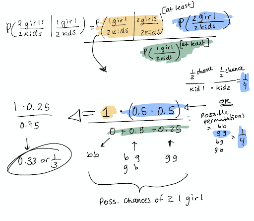

# Vim
`i` to insert  
<kbd>esc</kbd> to exit insert mode  
`:q` to quit  
`:wq` to write and quit (save and quit)  

[Vim Quick Reference](https://github.com/GalvanizeDataScience/course-outline/blob/20-10-DS-DEN_DEN19/quick-reference/Vim.pdf)

# VSCode
[VSCode Quick Reference - Linux](https://github.com/GalvanizeDataScience/course-outline/blob/20-10-DS-DEN_DEN19/quick-reference/VSCode_Linux.pdf)

# Regular Expressions (Regex)
[Build and Test Regex](https://regexr.com/)  
[Regex Guide with Examples](https://medium.com/factory-mind/regex-tutorial-a-simple-cheatsheet-by-examples-649dc1c3f285)


# Command Line

[DSI Lecture "Just enough command line"](https://github.com/GalvanizeDataScience/lectures/blob/Denver/unix/chris-reger/Unix.pdf)  
[Unix/Command Line Tutorial](http://www.ee.surrey.ac.uk/Teaching/Unix/)  
[Command Line Quick Reference](https://github.com/GalvanizeDataScience/course-outline/blob/20-10-DS-DEN_DEN19/quick-reference/LinuxUnix.pdf)  
Codecademy Quick Explanations: [1](https://www.codecademy.com/articles/command-line-commands), [2](https://www.codecademy.com/learn/learn-the-command-line/modules/learn-the-command-line-navigation/cheatsheet)

## Helper Commands that make everything easier.
* `clear` - Clears the terminal.
* `exit` - Exits the terminal.
* `man` *`command_name`* - Opens the manual for the command.
* <kbd>Tab</kbd> to autocomplete the line.
* Up or down arrows to scroll through previous commands.
* To jump to beginning of line: <kbd>CTRL + a</kbd>
* To jump to end of line: <kbd>CTRL + e</kbd>
* <kbd>Ctrl + C</kbd> to kill a job

## Common Commands

|Command|Meaning|
|----------|:-------------|  
|**ls**|lists the contents of your current working directory|  
|**ls -a**|lists all files and directories including hidden ones|
|**ls -l**|long descriptions|
|**ls -S**|sort by size|
|**ls -T**|sort by time last modified|
|**mkdir** *name_of_directory*|make a new directory|
|**touch** *name_of_file*|make a new file|
|**pwd**|shows the current working directory|
|**cd** *name_of_directory*|change directory|  
|**cd .**|change to current directory|
|**cd ..**|change to parent directory (one level up the tree/file structure)|
|**cd** or **cd ~**|change to home directory|
|**mv** *file_name* &nbsp;*new_file_location*|move a file to a new directory|
|**mv** *file_name* &nbsp;*new_file_name*|rename a file|
|**cp** *original_file_name* &nbsp;*new_file_name*|make a copy of a file|
|**rm** *file_name*|removes(deletes) the file|
|**rm -f** *file_name*|force deletion of the file if it is protected|
|**rm -r** *file_name*|recursive delete. removes all subfolders and files within the directory|
|**find . -name** *text_to_match*|find files in cd that match the text given| 
|**Exploring Files**||
|**cat** *file_name*|displays the contents of the file|
|**less** *file_name*|displays the contents of the file one page at a time|
|**head** *file_name*|displays the first ten lines of the file|
|**tail** *file_name*|displays the last ten lines of the file|
|**wc -w** *file_name*|word count of file|
|**wc -l** *file_name*|line count of file|
|**sort** *file_name*|sorts each line of file alphabetically|
|**uniq** *file_name*|removes duplicate lines|

` `  
` `  
## Simple searching using less

[How to use the **less** command](https://linuxize.com/post/less-command-in-linux/)  

Using less, you can search though a text file for a keyword (pattern). For example, to search through science.txt for the word 'science', type

    $ less science.txt

then, still in less, type a forward slash [/] followed by the word to search

    /science

As you can see, less finds and highlights the keyword. Type [n] to search for the next occurrence of the word.

` `  
` `  
## Searching using grep “global regular expression print”

grep is one of many standard UNIX utilities. It searches files for specified words or patterns. First clear the screen, then type

    $ grep science science.txt

As you can see, grep has printed out each line containg the word science.

Or has it ????

Try typing

    $ grep Science science.txt

The grep command is case sensitive; it distinguishes between Science and science.

To ignore upper/lower case distinctions, use the -i option, i.e. type

    $ grep -i science science.txt

To search for a phrase or pattern, you must enclose it in single quotes (the apostrophe symbol). For example to search for spinning top, type

    $ grep -i 'spinning top' science.txt

Some of the other options of grep are:  
**-v** display those lines that do NOT match  
**-n** precede each matching line with the line number  
**-c** print only the total count of matched lines
**-R** recursive. search all files in a directory
**-c** count of occurances


## Pipes


## Redirection
## **>**  

    $ cat oceans.txt > continents.txt
**>** takes the standard output of the command on the left and redirects it to the file on the right.

## **>>**
    $ cat glaciers.txt >> rivers.txt
**>>** takes the standard output of the command on the left and appends (adds) it to the file on the right.

## **<**
    $ cat < lakes.txt
**<** takes the standard input from the file on the right and inputs it into the program on the left.

## Advanced File and Directory Info


## File and Directory Permissions


## Running Python Files
* From the Command Line: `python name_of_file.py`
* Within IPython: `run name_of_file.py`
## Running Python Files with Inputs - Argparse
Can run python files and specify the inputs/arguments for the python file, all from the command line.  
[Argparse Tutorial](https://docs.python.org/3/howto/argparse.html)  

Examples:  

    $ python main.py --mode train --data training.csv --model price_predictor.pkl  
Python runs `main.py`, which uses command line argument parsing (Argparse) to take in arguments that affect how `main.py` executes. Here, `main.py` is running in train mode, so it will be expecting data with labels to train on in `training.csv`. After training, `main.py` will save the model and serialize it (pickle it), naming in `price_predictor.pkl`.

    $ python main.py --mode predict --data june.csv --model price_predictor.pkl --out predictions.csv  
Now `main.py` is running in predict mode, so it isn’t expecting labels with the `june.csv` data. `main.py` is using the earlier trained model (`price_predictor.pkl`)to make the predictions, and saving those predictions in `predictions.csv`.

# Git and GitHub
[DSI Git and GitHub Lecture](https://github.com/GalvanizeDataScience/lectures/blob/Denver/git-intro/frank-burkholder/Intro_Git_and_Github.pdf)  
[Visual Guide](http://ndpsoftware.com/git-cheatsheet.html#loc=workspace)  
[Git Quick Reference](https://github.com/GalvanizeDataScience/course-outline/blob/20-10-DS-DEN_DEN19/quick-reference/Git.pdf)

Each commit is taking a snapshot of your work so far which enables you to go back in time to older versions of your program. You will most certainly find yourself in a situation where you had some working code, modified it to add a new feature or work out some kink, only to find that you've hopelessly ruined everything and would give your left index finger just to get back to what you had before. Enter git.

## Key concepts
* Repository (a folder managed by git)
* Workspace (current state)
* Index (staged for commit)
* Commit (take a snapshot)
* Branch (a series of commits)
* Remote (a remote repository that you can push to or pull from)

Any folder can be turned into a git repository with git init. Your workspace is the current state of all your files. Some of them will be different from what was last committed. You can see what's different by running git status. From your workspace, you can use the git add command to add files to the index, which is a sort of staging area for commits. When you run git commit, the files in your index are included in the commit snapshot. You can use git reset to roll back to prior commits and you can use git log to see the history of commits.

## Key commands
* `git status`: see the status of the workspace, index, and what branch you're on
* `git add`: add files to the index (commit staging area)
* `git restore` *`file_name`*: discard local changes
    * `--staged` *`file`*: unstage file
* `git commit  -m` *`memo_of_commit_changes`*: take a snapshot of the project, committing the files in the index
* `git checkout`: switch to a different branch (use the -b option to switch to a new branch)
* `git branch`: list the branches
    * `--remote`: includes branches from the remote repo
        *   origin - personal version
        *   upstream - original that was forked
    * `-a`: lists all branches
    * `git branch` *`new_branch_name`*: creates new local branch 
    * `-m` *`old_name`* *`new_name`*: renames branch
* `git reset`: rollback to a previous commit
* `git push`: push up the changes in a local repository to a remote repository
* `git pull`: pull down the changes from a remote repository to the local repository
* `git clone *url_to_repo*`: copy a remote repository to the local machine
* `$ git log`: show previous commits
    * `-5`: show last 5
    * `--oneline -5`: more concise with relevant hash
## Git Workflow
[Git Workflow Options](https://buddy.works/blog/5-types-of-git-workflows)
1. Choose a feature/segment/thing to work on next
2. Write some code
3. Play with the code
4. Rewrite, play some more, etc.
5. git add .: add all your changes to the index
6. git commit -m "Describe the work you just did"
7. Repeat

## Git Remotes
[Git Basics - Working with Remotes](https://git-scm.com/book/en/v2/Git-Basics-Working-with-Remotes)  
[DSI Lecture - Git Remotes Walkthrough - Starts on Page 31](https://github.com/GalvanizeDataScience/lectures/blob/Denver/git-intro/frank-burkholder/Intro_Git_and_Github.pdf)


# Python Basics
[Python Quick Reference](https://github.com/GalvanizeDataScience/course-outline/blob/20-10-DS-DEN_DEN19/quick-reference/Python.pdf)

## Code Organization Best Practice - INEMB
```python
import modules

def functions():
class classes():

if __name__ == '__main__':
    #code when directly executed
```
## Lambda Functions
```python
lambda x: .9 * x if x > 3 else x
```
## List Comprehensions
Basic Structure:
* `[f(x) for x in sequence]`
* `[f(x) for x in sequence if condition]`
* `[f(x) if condition else g(x) for x in sequence]`
* `{key:value for x in sequence}`

``` python  
# Evaluate ways to return the absolute value of each element in a list

# In python 3 this will return a range object, which is a generator
a = range(-10,11)

# Let's cast it to a list
a = list(a)

# return the absolute value of each element in the list a using
# 1) a for loop
# 2) a functional built-in, map
# 3) a list comprehension

# using for loop (try to avoid this)
abs_a_for = []
for elem in a:
    abs_a_for.append(abs(elem))

## with functional builtins (map)
abs_a_map = list(map(abs,a))

## using a list comprehension (very Pythonic and fast)
abs_a_lstcomp = [abs(x) for x in a]
```

## Zip Function
```python
a1 = [1,2,3]
a2 = ['a','b','c']
print("The lists, separately:")
print(a1)
print(a2)

print("\nZipped together:")
a1a2 = list(zip(a1,a2))
print(a1a2)

print("\nHow it's often used:")
for v1, v2 in zip(a1, a2):
    print("a1: {0}, a2: {1}".format(v1, v2))

>>> The lists, separately:
    [1, 2, 3]
    ['a', 'b', 'c']

    Zipped together:
    [(1, 'a'), (2, 'b'), (3, 'c')]

    How it's often used:
    a1: 1, a2: a
    a1: 2, a2: b
    a1: 3, a2: c
```    

## Sets

A set combines some of the features of both the list and the dictionary. A set is defined as an unordered, mutable collection of unique items. This means that a set is a data structure where you can store items, without caring about their order and knowing that there will be at most one of them in the structure. Sets use a hash to link each item to membership or not. If you are going to check membership in a data structure, use a set.

```python
# how to initialize
my_set = set([1, 2, 3])
my_other_set = {1, 2, 3}
my_empty_set = {}  # uh, no....
print(type(my_set))
print(type(my_other_set))
print(type(my_empty_set)) # see?

>>> <class 'set'>
    <class 'set'>
    <class 'dict'>

empty_set_2 = set()
print(type(empty_set_2))

>>> <class 'set'>

my_set = {1, 2, 3}
my_other_set = {5, 6, 7}
my_set.union(my_other_set)
>>> {1, 2, 3, 5, 6, 7}

my_set.add(4)
my_set
>>> {1, 2, 3, 4}

my_set.update(my_other_set)
my_set
>>> {1, 2, 3, 4, 5, 6, 7}

my_set.remove(5)
my_set
>>> {1, 2, 3, 4, 6, 7}

my_set.intersection(my_other_set)
>>> {6, 7}
```
# Python OOP
[DSI OOP Lecture](https://github.com/GalvanizeDataScience/lectures/blob/Denver/oop/frank-burkholder/OOP.pdf)  

A **class** is a blueprint that describes the format of an object. It tells us what
attributes an object will store , and what methods that object will have available.
The class defines how an object is built.

## Advantages of OOP
* **Inheritance** - When a class is based on another class, building off of the existing
class to take advantage of existing behavior, while having additional specific
behavior of its own.
Example: class Animal, subclasses Mammal, Bird, Crustacean, etc
```python
class Rectangle(object):
    def __init__(self, w, h):
        self.w = w
        self.h = h

    def whoami(self):
        return 'rectangle'

    def area(self):
        return self.w * self.h


class Box(Rectangle):
    def __init__(self, w, h, d):
        super().__init__(w, h)
        self.d = d

    def whoami(self):
        return 'box'

    def volume(self):
        return self.w * self.h * self.d
```

* **Encapsulation** - The practice of hiding the inner workings of our class, and only
exposing what is necessary to the outside world. This idea is effectively the
same as the idea of abstraction, and allows users of our classes to only care
about the what (i.e. what our class can do) and not the how (i.e. how our class
does what it does).
Example: cards.reverse()
```python
import random

class Card(object):
    value_dict = {'2': 2, '3': 3, '4': 4, '5': 5, '6': 6, '7': 7,
                  '8': 8, '9': 9, '10': 10, 'J': 11, 'Q': 12,
                  'K': 13, 'A': 14}

    def __init__(self, number, suit):
        self.suit = suit
        self.number = number

    def __repr__(self):
        return "%s%s" % (self.number, self.suit)

    def __gt__(self, other):
      return self.value_dict[self.number] > self.value_dict[other.number]

    def __lt__(self, other):
      return self.value_dict[self.number] < self.value_dict[other.number]

    def __eq__(self, other):
      return self.value_dict[self.number] == self.value_dict[other.number]


class Deck(object):
    def __init__(self):
        self.cards = []
        for num in Card.value_dict.keys():
            for suit in 'cdhs':
                self.cards.append(Card(num, suit))

    def shuffle(self):
        random.shuffle(self.cards)

    def draw_card(self):
        if not self.isempty():
            return self.cards.pop()

    def add_cards(self, cards):
        self.cards.extend(cards)

    def __len__(self):
        return len(self.cards)

    def isempty(self):
        return self.cards == []
```

* **Polymorphism** - The provision of a single interface to entities of different types.
This enables us to use a shared interface for similar classes while at the same
time still allowing each class to have its own specialized behavior.
Example: integers and floats are implicitly polymorphic since you can add,
subtract, multiply and so on, irrespective of the fact that the types are different.

## Magic Methods

[More Magic Method Examples](https://www.tutorialsteacher.com/python/magic-methods-in-python)

### `__init__`
`__init__(self, [...)` : The initializer for the class. It gets passed whatever the primary constructor was called with (so, for example, if we called `x = SomeClass(10, 'foo')`, `__init__` would get passed 10 and 'foo' as arguments. `__init__` is almost universally used in Python class definitions.
 
```python
class Person: 
	
	# init method or constructor 
	def __init__(self, name): 
		self.name = name 
	
	# Sample Method 
	def say_hi(self): 
		print('Hello, my name is', self.name) 
	
p = Person('Nikhil') 
p.say_hi()

>>> Hello, my name is Nikhil
```


There are hundreds of common magic methods. A couple examples are shown below. In depth explanation here: [Magic Methods](https://github.com/RafeKettler/magicmethods/blob/master/magicmethods.markdown)

|Magic method| Purpose|
|:---|:---|
|`__init__(self, [..)` |Constructor, initializes the class|
|`__repr__(self)` |Defines format for how object should be represented|
|`__len__(self)` |Return number of elements in an object|
|`__gt__(self, other)` |Implements greater than operator, >|
|`__add__(self, other)` |Implements addition, +|  


# Linear Algebra

[DSI Linear Algebra Lecture](https://github.com/GalvanizeDataScience/lectures/blob/Denver/linear-algebra/frank-burkholder/Linear_Algebra_Intro.pdf)

## L1 Norm (Taxicab/Manhattan) and L2 Norm (Euclidean)


## Euclidean Distance


## Cosine Distance and Cosine Similarity


## Dot Product and Matrix Multiplication


# Numpy

[Offical Numpy Documentation](https://numpy.org/doc/1.19/)  
[Numpy Quick Reference](https://s3.amazonaws.com/assets.datacamp.com/blog_assets/Numpy_Python_Cheat_Sheet.pdf)  

* Numpy arrays can hold one and only one type of data.
* Numpy arrays are super efficient both in terms of memory footprint and computational efficiency.
* Numpy arrays have a size, and the size cannot be changed. No appending or extending.
* Numpy arrays have a shape, which allows them to be multi-dimensional (examples forthcoming).

## Importing Numpy, Creating a Numpy ndarray object, 

Always import as np
```python
import numpy as np
```
Ways to create an array
```python
mat = np.array([[4, -5], [-2, 3]])
vect = np.array([-13, 9])
column_vect = np.array([[13], [9]])
```
Using **.ones** and **.zeros**
```python
np.ones((2, 4))
array([[ 1.,  1.,  1.,  1.],
       [ 1.,  1.,  1.,  1.]])

np.zeros((3, 2))
array([[ 0.,  0.],
       [ 0.,  0.],
       [ 0.,  0.]])
```
**np.linspace**  
np.linspace creates an equally spaced grid of numbers between two endpoints.
```python
np.linspace(0, 1, num=11)
array([0. , 0.1, 0.2, 0.3, 0.4, 0.5, 0.6, 0.7, 0.8, 0.9, 1. ])
np.linspace(0, 10, num=11)
array([ 0.,  1.,  2.,  3.,  4.,  5.,  6.,  7.,  8.,  9., 10.])
np.linspace(0, 1, num=21)
array([0.  , 0.05, 0.1 , 0.15, 0.2 , 0.25, 0.3 , 0.35, 0.4 , 0.45, 0.5 ,
       0.55, 0.6 , 0.65, 0.7 , 0.75, 0.8 , 0.85, 0.9 , 0.95, 1.  ])
```
**np.arange**  
np.arange is just like the built in range, but it makes an array.
```python
np.arange(10)
array([0, 1, 2, 3, 4, 5, 6, 7, 8, 9])
np.arange(2, 10)
array([2, 3, 4, 5, 6, 7, 8, 9])
np.arange(0, 10, 2)
array([0, 2, 4, 6, 8])
```
The **np.random** subpackage contains some functions for creating arrays of random numbers. These two are the most useful, but there are more!
```python
np.random.uniform(low=0.0, high=10.0, size=10).round(2)
array([4.41, 6.95, 6.89, 7.95, 8.61, 8.62, 3.88, 8.15, 3.78, 3.07])

np.random.normal(loc=0.0, scale=1.0, size=10)
array([ 0.13174436,  1.0020539 ,  0.13017687, -0.49298764,  0.95413023,
        3.89193187,  0.88809727, -1.01596482,  1.2739377 ,  0.31801075])
```
## Finding the shape of the matrix or vector using .shape and reshaping using .reshape
```python
x = array([0, 1, 2, 3, 4, 5, 6, 7, 8, 9])
x.shape
(10,)

A = np.array([[2, 3, 5], [4, 5, 6]])
A.shape
(2, 3)
np.shape(A)
(2, 3)
```
**Reshaping**
Although the total size of an array cannot be changed, the shape of the array can be changed, as long as this change of shape does not create or destroy elements (i.e., as long as the reshaping does not change the size of the array).
```python
x = np.array([0, 1, 2, 3, 4, 5, 6, 7, 8, 9])
x
array([0, 1, 2, 3, 4, 5, 6, 7, 8, 9])
x.shape
(10,)
x.reshape((5, 2))
array([[0, 1],
       [2, 3],
       [4, 5],
       [6, 7],
       [8, 9]])
```
Reshaping is very efficient, but it does not make a copy of the array!
To make a copy of an array, use the `.copy` method:
```python
x = np.arange(10)
y = x.copy()
y[0] = 999
y
array([999,   1,   2,   3,   4,   5,   6,   7,   8,   9])
x
array([0, 1, 2, 3, 4, 5, 6, 7, 8, 9])
```
## Indexing

**Vector**
```python
x = array([0, 1, 2, 3, 4, 5, 6, 7, 8, 9])
# index into array
x[4]
4
# can multi-index into numpy array 
x[[2, 3, 5]]
array([2, 3, 5])
# if you aren't sure of how long an array is...
x[-1]
9
# can grab range of indices (slice)
x[:5]
array([0, 1, 2, 3, 4])
```
​**Matrix**
```python
x = np.arange(20).reshape((5, 4))
x
array([[ 0,  1,  2,  3],
       [ 4,  5,  6,  7],
       [ 8,  9, 10, 11],
       [12, 13, 14, 15],
       [16, 17, 18, 19]])
# First two rows.
x[:2, :]
array([[0, 1, 2, 3],
       [4, 5, 6, 7]])
# First two columns.
x[:, :2]
array([[ 0,  1],
       [ 4,  5],
       [ 8,  9],
       [12, 13],
       [16, 17]])
# First two rows and first two columns
x[:2, :2]
array([[0, 1],
       [4, 5]])
# Even numbered rows and columns
x[::2, ::2]
array([[ 0,  2],
       [ 8, 10],
       [16, 18]])

# using another array
x = np.arange(0, 20, 2)
x
array([ 0,  2,  4,  6,  8, 10, 12, 14, 16, 18])
x[[0, 0, 4, 4, 2, 2]]
array([0, 0, 8, 8, 4, 4])
```
## Sum, Min, Max, ArgMin, ArgMax

**Sum**
```python
x = np.arange(12).reshape((3, 4))
x
array([[ 0,  1,  2,  3],
       [ 4,  5,  6,  7],
       [ 8,  9, 10, 11]])
np.sum(x)
66
```
But you can also do row sums and column sums by supplying an axis argument.
```python
np.sum(x, axis=0)  # a column sum: 0 across columns
array([12, 15, 18, 21])
np.sum(x, axis=1)  # a row sum: 1 across rows 
array([ 6, 22, 38])
```
**Min and Max**
```python
x = array([[47, 83, 38, 53],
           [76, 24, 15, 49],
           [23, 26, 30, 43],
           [30, 26, 58, 92]])

np.max(x)
92
np.min(x)
15

# Column maximums
np.max(x, axis=0)
array([76, 83, 58, 92])

# Row maximums
np.max(x, axis=1)
array([83, 76, 43, 92])           
```
**ArgMin and ArgMax**
```python
np.argmin(x) # array is flattened before indexing
6
np.argmax(x)
15
np.argmax(x, axis=0) ## the row index (axis=0) of the column maximum
array([1, 0, 3, 3])
np.argmin(x, axis=1) # the column index (axis=1) of the row minimum
array([2, 2, 0, 1])
```
## Modifying Numpy Vectors and Matricies
Numpy arrays can't change size or dimensions, but you can modify their values.
```python
A = array([[3, 7, 2, 5],
           [9, 8, 1, 6],
           [2, 4, 6, 3]])

A[1,0] = 10

A
array([[ 3,   7,   2,   5],
       [10,   8,   1,   6],
       [ 2,   4,   6,   3]])
```
You can modify any slice. You can fill it in with a scalar.
```python
A[0:2,1:3] = 22

A
array([[ 3, 22, 22,  5],
       [10, 22, 22,  6],
       [ 2,  4,  6,  3]])
```
Or you can fill it in with another array of the appropriate size.
```python
A[:,2] = np.array([11, 12, 13])

A
array([[ 3, 22, 11,  5],
       [10, 22, 12,  6],
       [ 2,  4, 13,  3]])
```
If you want to double a row:
```python
A[2] = A[2] * 2

A
array([[ 3, 22, 11,  5],
       [10, 22, 12,  6],
       [ 4,  8, 26,  6]])
```
**Concatenate**
```python
A = np.array([[1, 2],
              [3, 4]])

B = np.array([[5, 6]])

np.concatenate((A, B))
array([[1, 2],
       [3, 4],
       [5, 6]])
       
np.concatenate((A, B.T), axis=1)
array([[1, 2, 5],
       [3, 4, 6]])
```
## Broadcasting

Elementwise Operations (+, -, /, *, **)
Happen to each element of the array individually.
```python
x = array([0, 1, 2, 3, 4, 5, 6, 7, 8, 9])
x + 1
array([ 1,  2,  3,  4,  5,  6,  7,  8,  9, 10])
x*3
array([ 0,  3,  6,  9, 12, 15, 18, 21, 24, 27])
x/10
array([0. , 0.1, 0.2, 0.3, 0.4, 0.5, 0.6, 0.7, 0.8, 0.9])
x**2
array([ 0,  1,  4,  9, 16, 25, 36, 49, 64, 81])
```
Equal Length Arrays
```python
a1=2
x1 = np.array([1,2,3,4])
print(a1*x1)
a2=4
x2 = np.array([5,6,7,8])
print(a2*x2)
print(a1*x1 + a2*x2)

[2 4 6 8]
[20 24 28 32]
[22 28 34 40]
```
**Matrix Broadcasting**
Can only be performed when the shape of each dimension in the arrays are equal and/or one has the dimension size of 1.
```python
y = array([[10., 10., 10., 10.],
           [10., 10., 10., 10.],
           [10., 10., 10., 10.],
           [10., 10., 10., 10.],
           [10., 10., 10., 10.]])

x = array([[5., 5., 5., 5.],
           [5., 5., 5., 5.],
           [5., 5., 5., 5.],
           [5., 5., 5., 5.],
           [5., 5., 5., 5.]])

z = y * x                                                                    

z                                                                            
array([[50., 50., 50., 50.],
       [50., 50., 50., 50.],
       [50., 50., 50., 50.],
       [50., 50., 50., 50.],
       [50., 50., 50., 50.]])
```
## Masking and Boolean Indexing
```python
a = np.random.randint(-10, 10, size = (20,))
b = np.random.randint(-10, 10, size = (20,))
a
array([  9,  -9,  -4,   0,  -4,   7,  -1,   6,   1, -10,   3,   1,   0,
         4,   5,   9,  -4, -10,   5,  -8])
b
array([  6,  -7,  -6,  -5,  -7,  -8,  -1,  -3,  -8,   3,  -7,  -5,  -9,
        -7,   8,  -2, -10,   3,   3, -10])
# this returns a boolean array
a >= 0
array([ True, False, False,  True, False,  True, False,  True,  True,
       False,  True,  True,  True,  True,  True,  True, False, False,
        True, False])
# this returns only the elements of b where the condition is True
b[a >= 0]
array([ 6, -5, -8, -3, -8, -7, -5, -9, -7,  8, -2,  3])
# you can perform arthmetic operations on the boolean array
print((a >= 0).sum()) # tells you how many elements are true
print((a >= 0).mean()) # gives you the average rate at which elements are true
12
0.6
b[(a >= 0) & (b >= 0)]
array([6, 8, 3])
```
## Identity Matrix and Matrix Inverse
```python
np.identity(3)
array([[1., 0., 0.],
       [0., 1., 0.],
       [0., 0., 1.]])
np.eye(3)
array([[1., 0., 0.],
       [0., 1., 0.],
       [0., 0., 1.]])
X = np.array([[1,2,3], [0,1,0], [-2, -1, 0]])
Y = np.linalg.inv(X)
print(Y)
np.round(Y, 5)
[[-1.85037171e-17 -5.00000000e-01 -5.00000000e-01]
 [ 3.70074342e-17  1.00000000e+00  1.85037171e-17]
 [ 3.33333333e-01 -5.00000000e-01  1.66666667e-01]]
array([[-0.     , -0.5    , -0.5    ],
       [ 0.     ,  1.     ,  0.     ],
       [ 0.33333, -0.5    ,  0.16667]])
X.dot(Y).astype(int)
array([[1, 0, 0],
       [0, 1, 0],
       [0, 0, 1]])
```
## Numpy L1 and L2 Norm calculation  
​
```python
x = array([0, 1, 2, 3, 4, 5, 6, 7, 8, 9])
print(np.sqrt(np.sum(x**2)))
print(np.linalg.norm(x))
16.881943016134134
16.881943016134134
# the norm is "L2" by default, but you can change that 
np.linalg.norm(x, ord=1)
45.0
```
## Dot Product and Matrix Multiplication

If we have two vectors  𝑥  and  𝑦  of the same length  (𝑛) , then the dot product is given by

𝑥⋅𝑦=𝑥1𝑦1+𝑥2𝑦2+⋯+𝑥𝑛𝑦𝑛
```python 
y = np.array([10, 9, 8, 7, 6, 5, 4, 3, 2, 1])
print(x)
print(y)
print(np.dot(x,y))
[0 1 2 3 4 5 6 7 8 9]
[10  9  8  7  6  5  4  3  2  1]
165
```
## Distance Between Vectors - Euclidean(l2) and Cosine Similarity

The distance between two vectors is the norm of the difference.
𝑑(𝑥,𝑦)=||𝑥−𝑦||
```python 
np.linalg.norm(x-y)
18.439088914585774
```
Cosine Similarity is the cosine of the angle between the two vectors, given by

𝑐𝑜𝑠(𝜃)=𝑥⋅𝑦||𝑥|| ||𝑦||
```python 
a = np.array([1,2,3,4])
b = np.array([5,6,7,8])
np.dot(a,b)/(np.linalg.norm(a)*np.linalg.norm(b))
0.9688639316269662
```
## Matrix Transpose
```python
X
array([[1, 2, 3],
       [4, 5, 6]])
X.T # X.transpose() also works
array([[1, 4],
       [2, 5],
       [3, 6]])
```
## Eigenvectors and Eigenvalues

Let  𝐴  be an  𝑛×𝑛  matrix and  𝑥  be an  𝑛×1  nonzero vector. An eigenvalue of  𝐴  is a number  𝜆  such that

𝐴𝑥=𝜆𝑥
 
A vector  𝑥  satisfying this equation is called an eigenvector associated with  𝜆
Eigenvectors and eigenvalues will play a huge roll in matrix methods later in the course (PCA, SVD, NMF).
```python
A = np.array([[1, 1], [1, 2]])
vals, vecs = np.linalg.eig(A)
vals
array([0.38196601, 2.61803399])
vecs
array([[-0.85065081, -0.52573111],
       [ 0.52573111, -0.85065081]])
vec0 = vecs[:, 0].reshape(-1, 1)
vec1 = vecs[:, 1].reshape(-1, 1)
vec0
array([[-0.85065081],
       [ 0.52573111]])
A.dot(vec0)
array([[-0.3249197 ],
       [ 0.20081142]])
vals[0]*vec0
array([[-0.3249197 ],
       [ 0.20081142]])
A.dot(vec1)
array([[-1.37638192],
       [-2.22703273]])
vals[1]*vec1
array([[-1.37638192],
       [-2.22703273]])
```
# Pandas

[**Official Pandas User Guide - Exceptional Docs**](https://pandas.pydata.org/pandas-docs/dev/user_guide/index.html#user-guide)   
[Pandas Quick Reference](https://github.com/GalvanizeDataScience/course-outline/blob/20-10-DS-DEN_DEN19/quick-reference/Pandas.pdf)   
[Pandas Examples](http://manishamde.github.io/blog/2013/03/07/pandas-and-python-top-10/)  

## Working with Data in Pandas - Workflow

[Data Wrangling Jupyter Notebook](https://nbviewer.jupyter.org/github/cs109/content/blob/master/lec_04_wrangling.ipynb)  
[Reshaping Data - Pandas Official Docs](https://pandas.pydata.org/pandas-docs/stable/user_guide/reshaping.html)

## 1: Explore the Data
```python
df = pd.read_csv('data/winequality-red.csv', delimiter=';')
df = pd.read_csv('my_data.csv', header=None) # if no header name
df = pd.read_csv('my_data.csv', header=None, names=['col1', 'col2', 'col3']) # add missing column names
df.head() # shows you the first rows, defaults to 5
df.tail() # shows you the last rows
df.shape  # give you the number of rows and number of cols
df.columns # gives you back a list of all the column names
df.info()  # allows you to look at the data type for each column and the number of null values.
df.describe() # gives you summary stats for all of your numeric columns
df.unique()
df['column name'].unique() # gives unique values in that column
```
## 2. Cleaning the Data and Dealing with Missing Data (Null, NaN, None)
Make sure you can justify how you are dealing with missing data. Is there a better option than eliminating the rows and columns with missing data?
```python
df2 = df.copy() # best practice to make a copy of the original data
cols = df2.columns.tolist()   # creates a list of the column names
cols = [col.replace('#', 'num') for col in cols] # this replaces the pound sign with num
cols = [col.replace(' ', '_'.lower())] # replace spaces with underscores and make everything lowercase
df2.columns = cols  # reassigning the new columns to the dataframe

# how to rename a column with pandas
df.rename(columns={'original column name' : 'new_column_name'}, inplace = True)

# how to deal with missing values
df.fillna(-1, inplace= True)  # this will fill all NA/NULL values with the value -1
df.dropna(inplace = True)    # this will just drop all column/spaces that have a NULL value

# creating and dropping columns
df['non_free_sulfer'] = df['total sulfur dioxide'] - df['free sulfur dioxide'] # add a new column titled non_free_sulfer

df.drop('non_free_sulfur2', axis =1. inplace = True) # Drop the non_free_sulfur2 column. Axis = 1 is referring to axis 1 which is columns

# Cast the date column as datetime object / how to add date and time with pandas
df['incident_date'] = pd.to_datetime(df['incident_date'])
```
## Indexing
```python
df['column name'] # grabs the column titled 'column name'
df[['column1' , 'column2']]   # how to access multiple columns 
df[:3] # this will grab from the beginning up to but not including the row at index 3
df[:1] # this will grab up to but not including 
```
**.loc and .iloc** 

[iloc and loc explanation and examples](https://www.shanelynn.ie/select-pandas-dataframe-rows-and-columns-using-iloc-loc-and-ix/)  

`.loc` is looking for labels or location  
`.iloc` is looking for indices  
`.iloc` is non-inclusive  
`.loc` is inclusive


## Groupby and Sort
**Grouping**  
When grouping you need to assign the group to a value or else it wil return the memory location.
When you group, the column you group by becomes the index. It will return all columns based on the groupby'd column.
```python
groupby_obj = df.groupby('column_name')
groupby_obj.mean()
groupby_obj.max()
groupby_obj.count()

# if you want to get a group by and a specific column:
df.groupby('column_name').count()['column_name2']

# how to group by multiple columns
df.groupby(['column1', 'column2']).count()['column3']

# how to group by an equation
df_new = df.groupby('column1').agg({'column2': 'sum', 'column3' : 'mean'}).reset_index()
```
**Sorting**
```python
df.sort_values('column_name') # default here is ascending
df.sort_values('column_name', ascending = False)

# a more specific sort
df['column_name'].sort_values(ascending = False) 

# you can sort by multiple columns by placing them in a list
# it will sort the first column passed first, then the second
df.sort_values(['column_1', 'column2'], ascending =[True, False]).reset_index(drop = True)
 ```   
## Masking
```python
df['column_name'] <= 0.08 # this just gives us a mask, tells us True or False whether each row fits the condition

df[df['column_name'] <= 0.08 ] # proper way to use a mask 
df[(df['column_name'] >= 0.04) & (df['column_name'] < 0.08)] # a more complicated mask
```
## Combining Datasets - .join, .merge, .concat
[DSI Jupyter Notebook on Combining Datasets](https://github.com/GalvanizeDataScience/lectures/blob/Denver/pandas/rosie-martinez/additional_resources/pandas_combining_data_notes.ipynb)  

## Pandas Graphing, Plotting, and Visualization

Pandas has some basic visualization options for quick EDA.  
[In Depth on Pandas Visualizations](https://pandas.pydata.org/pandas-docs/stable/user_guide/visualization.html)  
```python
df['quality'].plot(kind='hist')
df.hist(figsize = (10,10));
df.plot(kind='scatter', x='free_sulfur_dioxide', y='total_sulfur_dioxide')
df.plot(kind='box')
pd.plotting.scatter_matrix(df) 
```
# Matplotlib

[**DSI Lecture - Appendix is Especially Useful**](https://github.com/GalvanizeDataScience/lectures/blob/Denver/matplotlib/chris-reger/matplotlib_intro.ipynb)  
[Quick Reference - Matplotlib](https://github.com/GalvanizeDataScience/course-outline/blob/20-10-DS-DEN_DEN19/quick-reference/Matplotlib.pdf)  
[Examples and Explanations of More Complex Graphs](http://www.randalolson.com/2014/06/28/how-to-make-beautiful-data-visualizations-in-python-with-matplotlib/)  


```python
import matplotlib.pyplot as plt  #standards should be followed

# Set a style. the base style sucks. I also like fivethirtyeight'
plt.style.use('ggplot')
# Increasing master fontsize and setting a font type. Use bigger font for presentations.
matplotlib.rcParams.update({'font.size': 16, 'font.family': 'sans'})
```
## **Setting Up** 
```python
# number and organization of subplots, size of overall figure
fig, axs = plt.subplots(2, 3, figsize=(10, 5))

Iterating through the subplots.
for i, ax in enumerate(axs.flatten()): # extremely useful pattern
    
    # Adding the Actual Graphs/Plots - Examples
    # Line Graph
    ax.plot(x, x+13, color="purple", lw=1, ls='-', marker='o', markersize=2)
    # Scatter Plot
    ax.scatter(xx, xx + 0.25*np.random.randn(len(xx)))
    # Step Graph
    ax.step(n, n**2, lw=2)
    # Bar Chart
    ax.bar(n, n**2, align="center", width=0.5, alpha=0.5)
    # Fill_Between Graph
    ax.fill_between(x, x**2, x**3, color="green", alpha=0.5)

    # Every Graph
    ax.set_title("This is a Great Plot!") # ax.set_title(f"Plot: {i}")
    ax.set_xlabel("This is an x-label")
    ax.set_ylabel("This is a y-label!")
    # Only Sometimes
    ax.text(0.35, 0.4, "Hi Y'all!", fontsize=35) # text on the graph
    ax.set_xticks(x)
    ax.set_xticklabels(record_counts['genre'])
    ax.legend(loc=0) # add labels to each plot you add to the axe. loc determines where the legend goes
    ax.axvline(x_axis_location, color='red', linestyle='--', linewidth=1) # create a vertical line
    ax.fill_between(x_values, y_values_1, 0, where=(x_values > 25), color="red", alpha=0.2, label='middle 95%')

```


## **Line Styling on Line Graphs**
```python
fig, ax = plt.subplots(figsize=(12,6))

ax.plot(x, x+1, color="blue", linewidth=0.25)
ax.plot(x, x+2, color="blue", linewidth=0.50)
ax.plot(x, x+3, color="blue", linewidth=1.00)
ax.plot(x, x+4, color="blue", linewidth=2.00)

# possible linestype options ‘-‘, ‘--’, ‘-.’, ‘:’, ‘steps’
ax.plot(x, x+5, color="red", lw=2, linestyle='-')
ax.plot(x, x+6, color="red", lw=2, ls='-.')
ax.plot(x, x+7, color="red", lw=2, ls=':')

# possible marker symbols: marker = '+', 'o', '*', 's', ',', '.', '1', '2', '3', '4', ...
ax.plot(x, x+ 9, color="green", lw=2, ls='--', marker='+')
ax.plot(x, x+10, color="green", lw=2, ls='--', marker='o')
ax.plot(x, x+11, color="green", lw=2, ls='--', marker='s')
ax.plot(x, x+12, color="green", lw=2, ls='--', marker='1')

# marker size and color
ax.plot(x, x+13, color="purple", lw=1, ls='-', marker='o', markersize=2)
ax.plot(x, x+14, color="purple", lw=1, ls='-', marker='o', markersize=4)
ax.plot(x, x+15, color="purple", lw=1, ls='-', marker='o', markersize=8, markerfacecolor="red")
ax.plot(x, x+16, color="purple", lw=1, ls='-', marker='s', markersize=8, 
        markerfacecolor="yellow", markeredgewidth=2, markeredgecolor="blue")
```
  
```python
fig.tight_layout() # helps avoid overlapping graphs
```
## **Saving Graphs**
```python
# To save a figure to a file we can use the savefig method in the Figure class:
fig.savefig("filename.png")
# Here we can also optionally specify the DPI and choose between different output formats:
fig.savefig("filename.png", dpi=200)
```
# Data Visualization

[Choosing a Good Chart](https://extremepresentation.typepad.com/blog/files/choosing_a_good_chart.pdf)

## **What Makes a Good Graph**  

* Keep it simple and clean
* What is the point you are trying to get across?
* Make it readable
* Make sure your font sizes on your axes, ticks, titles, and legends are legible
* Use the correct graph for your data
* Colors and symbols matter just as much in a good visualization as the data you are using
* Remember your audience
* Your graph might make sense to another data scientist, but what about a CFO, your
grandmother, or someone who doesn’t know the first thing about data?
* A graph is only a graph until you provide context - storytelling, see below

## **The 8 Commandments of Data Storytelling**  

1. Begin with a question: Set up your story. What is your audience going to learn?
2. End with an insight: If we can’t learn something useful from the data, the story isn’t worth telling.
3. Tell a compelling story: People remember stories, not data. Take them on your journey.
4. Explain with visuals, Narrate with words: People understand metrics, trends, and patterns better with
visuals. Use words to add your voice to the data.
5. Be honest and credible: The clients we want value honesty. Don’t sugarcoat the negatives. And don’t
mislead with fractioned data.
6. Be clear and concise: Remove everything that is not part of your story. Save the other bits for another
time.
7. Know and cater to your audience: What are their interests and goals? Do they want the details, or just
the high-level summary?
8. Provide context: Compare metrics over time or to industry benchmarks. Numbers are meaningless
without context.

## **Types of Data**  

**Qualitative**: Descriptive information  
**Quantitative**: Numerical Information  
**Discrete**: Data can only take on certain values (int)  
**Continuous**: Data can take any value (float)  
**Nominal**: Non-numeric categories (brand)  
**Ordinal**: Numeric data with non-constant or unknown spacing (t-shirt sizes)  
**Interval**: Numeric data with uniform spacing (date)  
**Ratio**: Interval data with a natural zero  


## **Types of Plots and when to use them:**  

**Scatter**:  
Data Types: Continuous, Quantitative  
Comparing an X variable to a Y variable  
Used to observe relationships between variables  

**Line Plots**:  
Data Types: Continuous, Quantitative, Interval, Ordinal  
Constructed of lines connecting points called “markers” 
X-axis is ordinal or interval in nature, like a time series  

**Histograms**:  
Data Types: Continuous, Quantitative  
Creates “bins” to separate the data, convention says that each ‘bin’ is left inclusive, right exclusive  
Can show the overall distribution of the data  
Right Skewed - tail goes to the right (left is opposite)  
To calculate the proper number of bins: `#_bins = sqrt(n_samples)`  

**Kernel Density Plot**  
Can show the overall distribution of the data on a continuous interval allowing for smoother distributions by smoothing the noise  

**Bar Chart**:  
Data Types: All  
Used to represent the same variable over a number of domains  
Can show frequency distributions for discrete variables  
Should be sorted in order if x-labels are not ordinal  

**Box Plot**:  
Data Types: Continuous, Quantitative  
Used to visually represent the five number summary  
Can show the distribution's skew  
Can visually represent outliers  

**Violin Plot**  
Similar to box plot, but adds in the kernel density plot in each side (shows the distribution shape)  
Shows the summary statistics in the plot as well  

**Pie Chart**  
Useless  

**Heat Maps**  
Visually represent a matrix  
Typically used to show covariance and correlation  

## One Dimensional Scatterplot
```python
def one_dim_scatterplot(data, ax, jitter=0.2, **options):
    ## why jitter? especially for bootstraping
    if jitter:
        jitter = np.random.uniform(-jitter, jitter, size=data.shape)
    else:
        jitter = np.repeat(0.0, len(data))
    ax.scatter(data, jitter, **options)
    ax.yaxis.set_ticklabels([])
    ax.set_ylim([-1, 1])
    ax.tick_params(axis='both', which='major', labelsize=15)

fig, ax = plt.subplots(1, figsize=(12, 1))
one_dim_scatterplot(data, ax, s=15)
```
 

## Empirical Distribution Plot

```python
def empirical_distribution(x, data):
    '''Cumulative distribution for the data'''
    weight = 1.0 / len(data)
    count = np.zeros(shape=len(x))
    for datum in data:
        count = count + np.array(x >= datum)
    return weight * count
```

# STATS and PROBABILITY

[Seeing Theory - Visualize Concepts](https://seeing-theory.brown.edu/basic-probability/index.html)  

# Probability Distributions

[DSI Lecture - Probability Distributions](https://github.com/GalvanizeDataScience/lectures/blob/Denver/probability-distributions/fred-berendse/probability-distributions.pdf)  

A **random variable**, usually written X, is a variable whose possible values are
numerical outcomes of a random phenomenon.
The pattern of probabilities of a random variable is called its **distribution**.

**Cumulative Distribution Function (CDF)** - the probability that a random variable X has a value <=x

 

**Probability Mass Function (PMF)** - the probability of a particular value occurring (discrete)

  

**Probability Density Function (PDF)** - same as PMF, but for continuous variables
    * Density function doesn’t tell us the probability that our random variable will assume any specific value, but does tell us the probability that the output of the random variable will fall into a specific range

## Discrete Probability Distributions

**Uniform Distribution - Discrete**  
Describes a situation with a finite number of outcomes, where each outcome is as equally likely as any other.

 

**Bernouli Distribution**  
 The simplest discrete distribution. It is a model of a single flip of a (possibly unfair) coin.  

  

**Binomial Distribution**  
A counting distribution. It models flipping a (possibly unfair) coin some number of times, and counting how many times the coin lands heads.

  

**Hypergeometric Distribution**  
Another counting distribution. This one models a deck of cards of two types (say red cards and blue cards). If you shuffle the deck, draw some number of cards, and then count how many blue cards you have, this count is hyper geometrically distributed.  


 

**Poisson Distribution**  
Another counting distribution. The Poisson
distribution models a process where events happen at a fixed rate or frequency,
and you're watching it for a fixed amount of time.

This distribution is applicable only if the events are independent and identically
distributed.
* Independent - knowledge of event A tells you nothing about the probability of
event B
* Identically distributed - the probability of event A has the same distribution
as that of event B  


## Continuous Probability Distributions

**Uniform distribution - Continuous**  
There is also a continuous version of the Uniform Distribution. It also describes a
set of outcomes that are all equally likely, but this time any number in an interval is
a possible output of the random variable. For example, the position a raindrop falls
on a line segment (in a very large rainstorm) is uniformly distributed.  

  

**Normal Distribution (Gaussian)**  

  
 

**Exponential Distribution**  
A continuous distribution related to the Poisson
distribution.
* Poisson: How many events will you observe in a given time?
* Exponential: How much time will it take to observe the first event?  

  

## **Coding Distributions in Scipy**

**Creating a Distribution Object**
```python
import scipy.stats as stats

# Discrete Distributions
uniform_disc = stats.randint(low=0, high=10) # k = 0, 1, ..., 9
bernoulli = stats.bernoulli(p=0.4)
binomial = stats.binom(n=50, p=0.4)
hypergeom = stats.hypergeom(M=20, n=7, N=12) # non-standard parameters!
poisson = stats.poisson(mu=5) # mu is the same as lambda

# Continuous Distributions
uniform_cont = stats.uniform(loc=0, scale=10) # non-standard parameters!
normal = stats.norm(loc=0.0, scale=1.0) # non-standard parameters!
exponental = stats.expon(loc=2.0) # non-standard parameters!
```
**Finding CDF**  
```python
print("P(Binomial(n=50, p=0.4) <= 20) = ", binomial.cdf(20))
print("P(Normal(mu=0.0, sigma=1.0) <= 1.0 = ", normal.cdf(1.0))
P(Binomial(n=50, p=0.4) <= 20) =  0.5610349320400658
P(Normal(mu=0.0, sigma=1.0) <= 1.0 =  0.8413447460685429
```  

**Finding PMF**
```python
print("P(Binom(n=50, p=0.4) == 20) = ", binomial.pmf(20))
print("P(Poisson(lambda=5) == 7) = ", poisson.pmf(7))
P(Binom(n=50, p=0.4) == 20) =  0.11455855282952349
P(Poisson(lambda=5) == 7) =  0.10444486295705395
```

**Sampling Random Numbers**  
The rvs (Random ValueS) method samples from a distribution object.
```python
print("Ten random draws from a Binomial(n=50, p=0.4): ", binomial.rvs(10))
print("Ten random draws from a Normal(mu=0.0, sigma=1.0): ", normal.rvs(10))
Ten random draws from a Binomial(n=50, p=0.4):  [16 17 20 22 19 25 19 20 16 17]
Ten random draws from a Normal(mu=0.0, sigma=1.0):  [ 1.7594658   1.46029478 -0.06747751 -1.39694945 -0.20049015 -0.05654447 0.29456879  1.26254489  2.30070426  0.51292104]
```
# Sampling Distributions and Bootstraping

“The population is the object that interests us, and the sample is the lens through which we get to view it”
* All college students in colorado would be a population, a sample of that might be students randomly selected from the University of Boulder
* Many times there are restrictions around how many samples can be taken from a population (time, money, etc.), so Bootstraping is used to generate random samples from a sample taken.
* A bootstrap sample from a dataset is a sample taken **with replacement** from that dataset whose size is the size of the dataset itself.
* Whats the point of bootstraping? - The Bootstrap is a tool to quantify the variation in a statistical estimate. It can be used in almost any situation.

```python
def bootstrap_sample_medians(data, n_bootstrap_samples=10000): # data is the original sample
    bootstrap_sample_medians = []
    for i in range(n_bootstrap_samples):
        # creating one bootstrap sample
        bootstrap_sample = np.random.choice(data, size=len(data), replace=True) 
        # taking the staistic(median) form the sample and adding it to a list
        bootstrap_sample_medians.append(np.median(bootstrap_sample))  
    # returning the list of all the bootstrap sample medians (a distribution)
    return bootstrap_sample_medians
``` 

The distribution of the statistics (median) from the bootstrap samples can be used to determine confidence intervals for the population median.  
```python
left_endpoint = np.percentile(bootstrap_sample_medians, 2.5)
right_endpoint = np.percentile(bootstrap_sample_medians, 97.5)
population_median_confidence_interval = [left_endpoint, right_endpoint]
```

# Central Limit Theorem

States that the distribution of sample means taken from a population >30 will always be normal.
This only holds true for the mean, no other sample statistics.
The Central Limit Theorem allows us to make probabilistic statements about the sample mean from any population using the normal distribution.  


## Compute Confidence Interval Function
```python
def compute_confidence_interval(data, confidence_width):
    sample_mean = np.mean(data)
    sample_varaince = np.var(data)
    distribution_of_sample_minus_population_mean = stats.norm(0, np.sqrt(sample_varaince / len(data)))
    alpha = distribution_of_sample_minus_population_mean.ppf(0.5 - (confidence_width / 2.0))
    # Alpha is negative
    return sample_mean + alpha, sample_mean - alpha
```
# Maximum Likelihood Estimation

The goal is to find the distribution(type and parameters) that best fits the data you have.

## Calculating the Log Likelihood given the data, the distribution type, and the distribution parameters.
```python
import numpy as np
import scipy.stats as stats
import scipy.optimize as optim

def log_likelihood_normal_one_parameter(mu):
    normal = stats.norm(mu, 1,0)
    likelihoods = [normal.pdf(datum) for datum in data]
    return np.sum(np.log(likelihoods))

def log_likelihood_normal_two_parameters(mu, sigma_sq):
    normal = stats.norm(mu, np.sqrt(sigma_sq))
    likelihoods = [normal.pdf(datum) for datum in data]
    return np.sum(np.log(likelihoods))
```

## Using Scipy Optimize to determine the parameters that maximize the Log-Likelihood (best fit the data)
```python
# optim does gradient descent, not gradient ascent
def minus_log_likelihood_normal_two_parameters(mu, sigma):
    return -log_likelihood_normal_two_parameters(mu, sigma)

# The optimizer needs a function that consumes a single numpy array
def wrapper_for_scipy(x):
    return minus_log_likelihood_normal_two_parameters(x[0], x[1])

fit_parms = optim.minimize(wrapper_for_scipy, (0, 1), method='Nelder-Mead')
mu_hat, sigma_sq_hat = fit_parms.x
```

# Binomial Tests

[StatQuest Video - Binomial Distribution and Test](https://www.youtube.com/watch?v=J8jNoF-K8E8)  

**Binomial Test** - A specific type of hypothesis test involving random variables
that can be modeled by the binomial distribution (i.e. they fall into two
categories)  
**Probability** - We know the parameters of a distribution and we would like to study properties of data generated from that distribution  
**Statistics** - Have data generated from a random variable, and we would like to infer properties of its distribution   
**P-value** - "The probability of observing data at least as extreme as the observation given the null hypothesis"
* If the p-value is smaller than your stated threshold (generally 0.05), must assume that the skeptic’s hypothesis (H-null) is NOT true.  

**Hypothesis Testing**  
1. State a scientific question - its answer should be yes or no
2. State a null hypothesis - the skeptic’s answer to the question
3. State an alternative hypothesis - the non-skeptic’s answer to the question
4. Create a model - the model assumes the null hypothesis is true
5. Set a threshold - decide how surprised you need to be to reject the null
hypothesis
6. Collect your data
7. Calculate a p-value - the probability of finding a result equally or more
extreme if the null hypothesis is true
8. Compare the p-value to your stated rejection threshold

## Coding a Binomial Test
**Create the Null Hypothesis**  
**Determine Significance Level (Alpha)**

\# of kickflips landed | Null Hypothesis ~ Binomial(n = 100, p = 0.8)  
alpha= 0.20  &nbsp;&nbsp;-a typical alpha is 0.05
```python
binomial = stats.binom(100, 0.8)

fig, ax = plt.subplots(1, figsize=(16, 4))
bars = ax.bar(range(101), [binomial.pmf(i) for i in range(101)], align="center", color="grey")
ax.set_xlim(0, 101)
ax.set_title("# of Kickflips Landed Under The Null Hypothesis")
```


**Collect the Data**  

Matt landed 84 of 100 kickflips.

**Calculate the Probability of Finding a Result Equally or More Extreme than Actually Observed Assuming the Probabilistic Model You Created. (The Null Hypothesis)**
```python
fig, ax = plt.subplots(1, figsize=(16, 4))
bars = ax.bar(range(101), [binomial.pmf(i) for i in range(101)], color="grey", align="center")
ax.set_xlim(0, 101)

for i in range(84, 101):
    bars[i].set_color('red')
    
ax.set_title("P-value Region")
```
  
```python
prob_equal_or_more_extreme = 1 - binomial.cdf(83)
print("Probability of Observing Data More Equal or More Extreme than Actual: {:2.2}".format(
    prob_equal_or_more_extreme))
```
Probability of Observing Data More Equal or More Extreme than Actual: 0.19  
Compare the P-Value to Your Stated Rejection Threshold of 0.20.

# Hypothesis Testing

[**Great Explanation of Hypothesis Testing with Examples - Just Open This!**](https://towardsdatascience.com/hypothesis-testing-in-machine-learning-using-python-a0dc89e169ce)  

[Types of Hypothesis Tests and When to Use Them](https://github.com/GalvanizeDataScience/lectures/blob/Denver/hypothesis-testing/kayla-thomas/resources/hypo_formulas.pdf)  

## Hypothesis Testing Workflow   

1. State a scientific question - its answer should be yes or no
2. State a null hypothesis - the skeptic’s answer to the question
3. State an alternative hypothesis - the non-skeptic’s answer to the question
4. Create a model - the model assumes the null hypothesis is true
5. Set a threshold - decide how surprised you need to be to reject the null
hypothesis
6. Collect your data
7. Calculate a p-value - the probability of finding a result equally or more
extreme if the null hypothesis is true
8. Compare the p-value to your stated rejection threshold


**One tailed test** :- A test of a statistical hypothesis , where the region of rejection is on only one side of the sampling distribution , is called a one-tailed test.
* Example :- a college has ≥ 4000 student or data science ≤ 80% org adopted.  

**Two-tailed test** :- A two-tailed test is a statistical test in which the critical area of a distribution is two-sided and tests whether a sample is greater than or less than a certain range of values. If the sample being tested falls into either of the critical areas, the alternative hypothesis is accepted instead of the null hypothesis.
* Example : a college != 4000 student or data science != 80% org adopted

# Statistical Power

[How Power, Alpha, Effect Size, and Sample Size Interact - Visualization](https://rpsychologist.com/d3/nhst/)  

## What is Power

* The “power” of our hypothesis test to detect an effect if there actually is one.
* Given that the true distribution is H1, the probability our test rejects the (false) null hypothesis.
* False Positive = Type 1 Error = Rejected the Null Hypothesis when shouldn't have
* False Negative = Type 2 Error = Failed to Reject the Null Hypothesis when should have rejected it
* As each of alpha, n, and effect size increase, so does power (all directly related).


## Sample Code for Determining Power and Sample Size
```python
from scipy import stats
from math import ceil

def z_power(alpha, n, mu_a, mu_b, s):
    '''Calculates the power of a one-tailed Z-test.
        Args:
            alpha: Allowable Type I error rate.
            n: Sample size.
            mu_a: The mean value of a
            mu_b: The mean value of b
            s: The standard deviation of a
        Returns:
            power: the power of the z-test
    '''
    stderr = s / n**.5
    score = (mu_b - mu_a)/stderr - stats.norm.ppf(1-alpha)
    return stats.norm.cdf(score)

def z_solve_for_n(power, alpha, mu_a, mu_b, s):
    '''Solves for the number of samples needed
        to achieve a particular power on a one-tailed Z-test.
        Args:
            power: The desired power.
            alpha: Allowable Type I error rate.
            mu_a: The mean value of a
            mu_b: The mean value of b
            s: The standard deviation of a (note: We make a simplying assumption that)
        Returns:
            n: The required sample size.
    '''
    return ((stats.norm.ppf(power) - stats.norm.ppf(alpha)) * s / (mu_b - mu_a) )**2

if __name__ == "__main__":
    # Breakout 2 starting code
    alpha = 0.20 # tolerated Type I error rate (incorrectly rejecting H0)
    beta = 0.05   # tolerated Type II error rate (failing to reject H0 when we should)
    power = 1 - beta

    mu_a = 0.06  # the mean value of a
    mu_b = 0.07  # the mean value of b
    s = 0.24    # the standard deviation of a
    
    required_n = z_solve_for_n(power, alpha, mu_a, mu_b, s)
    print(required_n)
```


# Bayesian Statistics and Hypothesis Testing

**Prior Probability** - A PMF / PDF representing your intital beliefs about the parameter(s)  
**Likelihood** - The probability of observing the data given the parameter(s)  
**Posterior Probability** - The product of prior and likelihood (bayesian-update)
* the posterior probability becomes the prior of the next update    

**Normalizing Constant** - the probability of observing the data.  

**Bayes Rule: P(A|B) = P(B|A)P(A) / P(B)**  


## Bayes Formula Example 1




## Bayes Formula Example 2


## Class Implementing Bayesian Updating    
```python
import matplotlib.pyplot as plt

class Bayes(object):
    def __init__(self, prior, likelihood_func):
        '''
        INPUT:
        prior (dict): key is the value (e.g. 4-sided die),
                      value is the probability
        likelihood_func (function): takes a new piece of data and the value and
                                    outputs the likelihood of getting that data
        '''
        self.prior = prior
        self.likelihood_func = likelihood_func
    def normalize(self):
        '''
        INPUT: None
        OUTPUT: None
        Makes the sum of the probabilities equal 1.
        '''
        total = float(sum(self.prior.values()))
        for key in self.prior:
            self.prior[key] /= total

    def update(self, data):
        '''
        INPUT:
            data (int or str): A single observation (data point)
        OUTPUT: None
        
        Conduct a bayesian update. Multiply the prior by the likelihood and
        make this the new prior.
        '''
        for key in self.prior:
            self.prior[key] *= self.likelihood_func(data, key)
        self.normalize()

    def print_distribution(self):
        '''
        Print the current posterior probability.
        '''
        sorted_keys = sorted(self.prior.keys())
        for key in sorted_keys:
            print("{}: {}".format(key, self.prior[key]))

    def plot(self, title=None, **kwargs):
        '''
        Plot the current prior.
        '''
        sorted_keys = sorted(self.prior.keys())
        sorted_probs = [self.prior[key] for key in sorted_keys]
        plt.plot(sorted_keys, sorted_probs, **kwargs)
        plt.title(title)
```

**Example Likelihood Function**
```python
def coin_likelihood(data, p):
    # what is the likelihood of drawing data
    # given that the heads probability is p
    # data = 0 for tails, 1 for heads
    if data:
        return p
    return 1-p
```

# Docker

**TODO

# AWS

## Amazon Elastic Compute Cloud (Amazon EC2)
Computing Power  
Secure, resizable compute capacity in the cloud  
[EC2](https://aws.amazon.com/ec2)

## Amazon Simple Storage Service (Amazon S3)
Storage  
[S3](https://aws.amazon.com/s3/)

# SQL, PostgreSQL, psycopg2

**TODO

# MongoDB, pymongo

**TODO

# Web Scraping, APIs

**TODO

# Spark, Spark SQL and Dataframes

**TODO

# Model Bias vs Variance

**TODO: Need to expand this section


# Cross Validation

## Leave One Out Cross Validation (LOOCV)

## k-Fold Cross Validation

1. Randomly shuffle the data, then divide the dataset into k different equally-sized subsets or "folds", usually 5 or 10.

2. Set aside the first subset of data and train a model using the remaining k-1 subsets as training data.

3. Calculate training error rate (with the k-1 subsets) and validation error rate from the subset that was set aside.

4. Repeat steps 2 and 3 with each of the remaining subsets held out, so that each observation is used for validation exactly once.

5. Combine the training and validation error estimates collected by repeating step 3, usually by taking their mean.

# k-Nearest Neighbors (kNN)

Strengths:
* Conceptually simple
* Easy to train
* High accuracy
* Insensitive to outliers
* No assumptions about data

Weaknesses:
* As the number of dimensions(features) increases, the harder it becomes to effectively use kNN due to the increase in n(sample size/number of observations) that is required. 
* Low Interpretability
* Prediction time can become grows at same rate as the number of data points. Computationally expensive, requires a lot of memory.

## Basic Outline of kNN Workflow

```
Calculate the distances from each data point to x
Order the points by distance from lowest to highest
The first k points are the "k nearest neighbors"
Return a prediction:
    If this is a classification problem (y is categorical):
        return the most common label among the k nearest neighbors
    If this is a regression problem (y is continuous):
        return the mean of the y values of the k nearest neighbors
```

## Identifying the most relevant distance metric. 

Choosing the correct distance metric is crucial to your results. Choices depend on the data you are working with and the question you are trying to answer.
Common Distance metrics:
* **Euclidean Distance, or L2 norm** - This is simply the straight line distance between 2 data points.
* **Cosine Similarity** - A measure of the angle between the two vectors. Used when the relative direction of two vectors is more important than the relative magnitude. One area where it is particularly popular is in assessing text similarity.

We need to categorize the star as a red or blue datapoint.  


Using Euclidean Distance  


Using Cosine Similarity  


## Determining the optimal value for k, the number of nearest neighbors.
Use Cross Validation  
**TODO: Need to add more about the bias-variance tradeoff for different values of k.